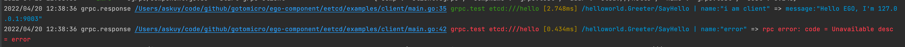
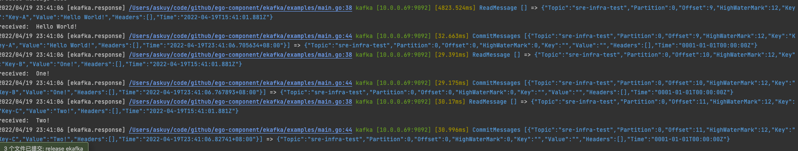
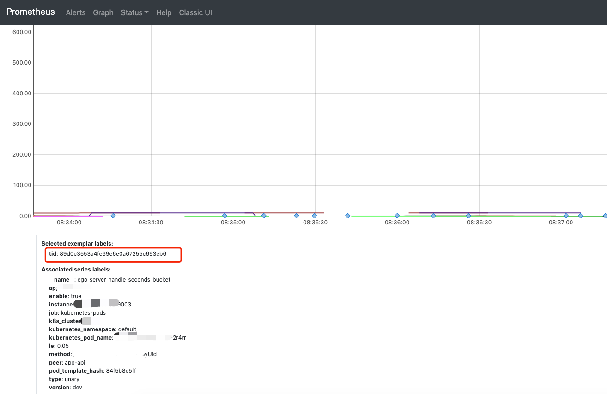
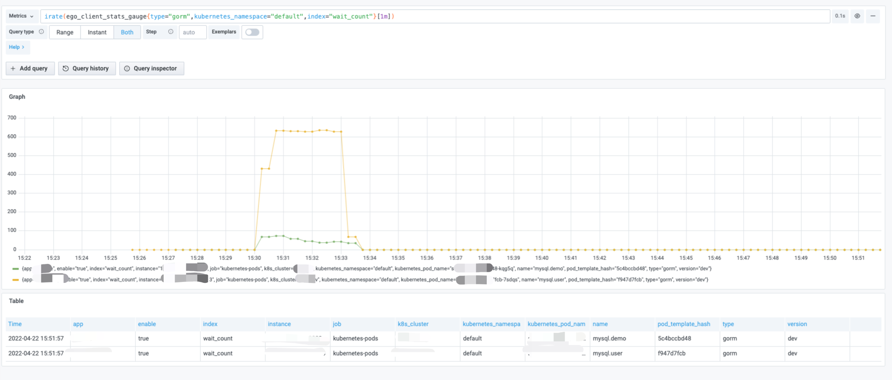
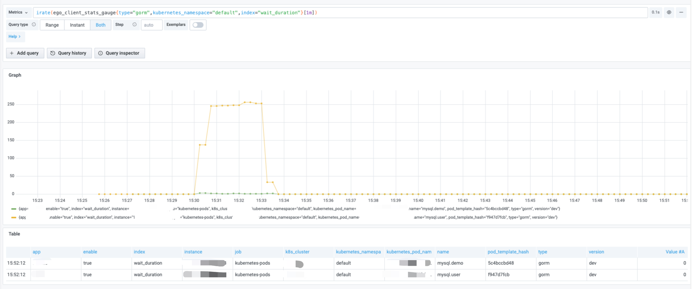

## EGO 1.0.3 release

## 更好的维护EGO-Component

为了更好的维护组件，我们将[https://github.com/gotomicro/ego-component](https://github.com/gotomicro/ego-component)做了拆包处理
现在新版本的组件在 [https://github.com/ego-component](https://github.com/ego-component) 下

升级方式

```
# 1 在goland中全局替换 github.com/gotomicro/ego-component => github.com/ego-component
# 2 删除 go.mod 中的 github.com/gotomicro/ego-component
# 3 go mod tidy
# 4 升级成功
```

## 新版本特效

### 1 EGO组件支持otel
gRPC Client、HTTP Client、gRPC Server、HTTP Server、MySQL、Redis、Kafka组件已按照官方标准支持otel

### 2 EGO组件增强DEBUG模式能力
debug模式的六元组能力：代码行号、配置名、目标地址、耗时、请求数据、响应数据

gRPC、HTTP、MySQL、Redis、Kafka、Mongo 客户端组件在EGO_DEBUG模式下，支持直接打印业务代码运行的真正路径，在IDE模式下，可以直接点击该链接跳转到对应的代码地方

gRPC的debug模式


kafka的debug模式


### 3 HTTP、gRPC服务在Prometheus的Exemplar特性
EGO的HTTP，gRPC服务都可以使用Prometheus的Exemplar特性，在metric中写入otel的trace id。这样我们就可以在metric中，看到最慢的趋势，在图中找到trace
id，去trace或者log中查看变慢的原因。


### 4 Gorm、Redis支持更强大的stat监控模式

* 我们可以通过gorm的wait_count、wait_duration等9个监控指标，可以看到Go MySQL Client是否阻塞 
* 我们可以通过redis的idle_conns、total_conns等6个监控指标，可以看到Go Redis Client是否阻塞

在高并发条件下，监控这些指标，可以很方便帮助我们排查我们的连接数设置不合理。如果指标存在异常，可以优化连接池配置。

以下是一个压测过程中，可以看到MySQL的连接数耗尽，导致大量在go内部的阻塞和等待时间。这个并发在MySQL服务端是体现不出任何异常，只会导致Go MySQL Client内部的阻塞。 以下是一个MySQL客户端阻塞的请求数图

以下是一个MySQL客户端阻塞的等待时间图


使用以上功能，请升级gorm，redis版本

```
go get github.com/ego-component/egorm@v1.0.4
go get github.com/ego-component/eredis@v1.0.3
```

### 5 补充大量文档

在每个组件的 [https://github.com/ego-component](https://github.com/ego-component) Readme里补充了相应的文档

| Component Name            | Code                                                                 | Example                                                                        | Doc                                                                                                                 |
|---------------------------|----------------------------------------------------------------------|--------------------------------------------------------------------------------|---------------------------------------------------------------------------------------------------------------------|
| HTTP Server               | [Code](https://github.com/gotomicro/ego/tree/master/server/egin)     | [Example](https://github.com/gotomicro/ego/tree/master/examples/server/http)   | [Doc](https://ego-org.com/frame/server/http.html)                                                                  |
| gRPC Server               | [Code](https://github.com/gotomicro/ego/tree/master/server/egrpc)    | [Example](https://github.com/gotomicro/ego/tree/master/examples/server/grpc)   | [Doc](https://ego-org.com/frame/server/grpc.html#example)                                                          |
| Governance Service        | [Code](https://github.com/gotomicro/ego/tree/master/server/egovernor) | [Example](https://github.com/gotomicro/ego/tree/master/examples/server/governor) | [Doc](https://ego-org.com/frame/server/governor.html)                                                              |
| Job                       | [Code](https://github.com/gotomicro/ego/tree/master/task/ejob)       | [Example](https://github.com/gotomicro/ego/tree/master/examples/task/job)     | [Doc](https://ego-org.com/frame/task/job.html)                                                                     |
| Corn job                  | [Code](https://github.com/gotomicro/ego/tree/master/task/ecron)      | [Example](https://github.com/gotomicro/ego/tree/master/examples/task/cron)     | [Doc](https://ego-org.com/frame/task/cron.html#_3-%E5%B8%B8%E8%A7%84%E5%AE%9A%E6%97%B6%E4%BB%BB%E5%8A%A1)          |
| Distributed Scheduled Job | [Code](https://github.com/gotomicro/ego/tree/master/task/ecron)      | [Example](https://github.com/gotomicro/ego/tree/master/examples/task/cron)     | [Doc](https://ego-org.com/frame/task/cron.html#_4-%E5%88%86%E5%B8%83%E5%BC%8F%E5%AE%9A%E6%97%B6%E4%BB%BB%E5%8A%A1) |
| HTTP Client               | [Code](https://github.com/gotomicro/ego/tree/master/client/ehttp)    | [Example](https://github.com/gotomicro/ego/tree/master/examples/http/client)   | [Doc](https://ego-org.com/frame/client/http.html#example)                                                          |
| gRPC Client               | [Code](https://github.com/gotomicro/ego/tree/master/client/egrpc)    | [Example](https://github.com/gotomicro/ego/tree/master/examples/grpc/direct)   | [Doc](https://ego-org.com/frame/client/grpc.html#_4-%E7%9B%B4%E8%BF%9Egrpc)                                        |
| gRPC Client using ETCD    | [Code](https://github.com/ego-component/tree/master/eetcd)           | [Example](https://github.com/ego-component/tree/master/eetcd/examples)         | [Doc](https://ego-org.com/frame/client/grpc.html#_5-%E4%BD%BF%E7%94%A8etcd%E7%9A%84grpc)                           |
| gRPC Client using k8s     | [Code](https://github.com/ego-component/tree/master/ek8s)            | [Example](https://github.com/ego-component/tree/master/ek8s/examples)          | [Doc](https://ego-org.com/frame/client/grpc.html#_6-%E4%BD%BF%E7%94%A8k8s%E7%9A%84grpc)                            |
| Sentinel                  | [Code](https://github.com/gotomicro/ego/tree/master/core/esentinel)  | [Example](https://github.com/gotomicro/ego/tree/master/examples/sentinel/http) | [Doc](https://ego-org.com/frame/client/sentinel.html)                                                              |
| MySQL                     | [Code](https://github.com/ego-component/tree/master/egorm)           | [Example](https://github.com/ego-component/tree/master/egorm/examples)         | [Doc](https://ego-org.com/frame/client/gorm.html#example)                                                          |
| Redis                     | [Code](https://github.com/ego-component/tree/master/eredis)          | [Example](https://github.com/ego-component/tree/master/eredis/examples)        | [Doc](https://ego-org.com/frame/client/redis.html#example)                                                         |
| Redis Distributed lock    | [Code](https://github.com/ego-component/tree/master/eredis)          | [Example](https://github.com/ego-component/tree/master/eredis/examples)        | [Doc](https://ego-org.com/frame/client/redis.html#example)                                                         |
| Mongo                     | [Code](https://github.com/ego-component/tree/master/emongo)          | [Example](https://github.com/ego-component/tree/master/emongo/examples)        | [Doc](https://ego-org.com/frame/client/mongo.html)                                                                 |
| Kafka                     | [Code](https://github.com/ego-component/tree/master/ekafka)          | [Example](https://github.com/ego-component/tree/master/ekafka/examples)        | [Doc](https://ego-org.com/frame/client/kafka.html)                                                                 |
| ETCD                      | [Code](https://github.com/ego-component/tree/master/eetcd)           | [Example](https://github.com/ego-component/tree/master/eetcd/examples)         | [Doc](https://ego-org.com/frame/client/eetcd.html)                                                                 |
| K8S                       | [Code](https://github.com/ego-component/tree/master/ek8s)            | [Example](https://github.com/ego-component/tree/master/ek8s/examples)          | [Doc](https://ego-org.com/frame/client/ek8s.html)                                                                  |
| Oauth2                    | [Code](https://github.com/ego-component/tree/master/eoauth2)         | [Example](https://github.com/ego-component/tree/master/eoauth2/examples)       ||

## 欢迎大家使用EGO

* EGO框架：[https://github.com/gotomicro/ego](https://github.com/gotomicro/ego)
* EGO组件: [https://github.com/ego-component](https://github.com/ego-component)
