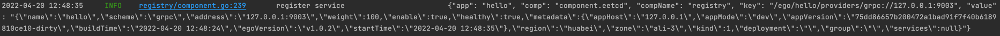
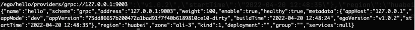
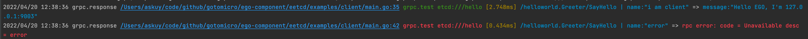

# ETCD
[](https://goproxy.cn/stats/github.com/ego-component/eetcd)
[](https://github.com/ego-component/eetcd)
[](https://opensource.org/licenses/MIT)
[](https://github.com/ego-component/eetcd/tree/master/examples)
[](https://ego.gocn.vip/frame/client/eetcd.html)


## 1 简介
对 `etcd` 进行了轻量封装，并提供了以下功能：
- 规范了标准配置格式，提供了统一的 Load().Build() 方法。
- 支持grpc的服务注册与发现
- 支持etcd的配置中心


## 2 使用方式
```bash
go get github.com/ego-component/eetcd
```

## 4 配置
```go
type config struct {
    Addrs                        []string      // 地址
    CertFile                     string        // cert file
    KeyFile                      string        // key file
    CaCert                       string        // ca cert
    UserName                     string        // 用户名
    Password                     string        // 密码
    ConnectTimeout               time.Duration // 连接超时时间
    AutoSyncInterval             time.Duration // 自动同步member list的间隔
    EnableBasicAuth              bool          // 是否开启认证
    EnableSecure                 bool          // 是否开启安全
    EnableBlock                  bool          // 是否开启阻塞，默认开启
    EnableFailOnNonTempDialError bool          // 是否开启gRPC连接的错误信息
}
```

## 5 服务注册
## 5.1 用户配置
```toml
[etcd]
addrs=["127.0.0.1:2379"]
connectTimeout = "1s"
secure = false
[registry]
scheme = "etcd" # grpc resolver默认scheme为"etcd"，你可以自行修改
#ServiceTTL = "10s"
```

## 5.2 用户代码
配置创建一个 ``etcd`` 的配置项，其中内容按照上文配置进行填写。以上这个示例里这个配置key是``etcd``

代码中创建一个 ``etcd`` 实例 ``eetcd.Load({key}).Build()``，代码中的 ``key`` 和配置中的 ``key`` 要保持一致。

```go
package main

import (
	"context"

	"github.com/ego-component/eetcd"
	"github.com/ego-component/eetcd/examples/helloworld"
	"github.com/ego-component/eetcd/registry"
	"github.com/gotomicro/ego"
	"github.com/gotomicro/ego/core/elog"
	"github.com/gotomicro/ego/server"
	"github.com/gotomicro/ego/server/egrpc"
	"google.golang.org/grpc/codes"
	"google.golang.org/grpc/status"
)

//  export EGO_DEBUG=true && go run main.go --config=config.toml
func main() {
	if err := ego.New().
		Registry(registry.Load("registry").Build(registry.WithClientEtcd(eetcd.Load("etcd").Build()))).
		Serve(func() server.Server {
			component := egrpc.Load("server.grpc").Build()
			helloworld.RegisterGreeterServer(component.Server, &Greeter{})
			return component
		}()).Run(); err != nil {
		elog.Panic("startup", elog.Any("err", err))
	}
}

type Greeter struct {
	helloworld.UnimplementedGreeterServer
}

func (g Greeter) SayHello(context context.Context, request *helloworld.HelloRequest) (*helloworld.HelloResponse, error) {
	if request.Name == "error" {
		return nil, status.Error(codes.Unavailable, "error")
	}

	return &helloworld.HelloResponse{
		Message: "Hello EGO",
	}, nil
}
```
## 5.3 数据展示



## 6 服务发现
## 6.1 用户配置
```toml

[etcd]
addrs=["127.0.0.1:2379"]
connectTimeout = "1s"
secure = false
[registry]
scheme = "etcd" # grpc resolver默认scheme为"etcd"，你可以自行修改
```

## 6.2 用户代码
配置创建一个 ``etcd`` 的配置项，其中内容按照上文配置进行填写。以上这个示例里这个配置key是``etcd``

代码中创建一个 ``etcd`` 实例 ``eetcd.Load({key}).Build()``，代码中的 ``key`` 和配置中的 ``key`` 要保持一致。

```go
package main

import (
	"context"

	"github.com/gotomicro/ego"
	"github.com/gotomicro/ego/client/egrpc"
	"github.com/gotomicro/ego/core/elog"

	"github.com/ego-component/eetcd"
	"github.com/ego-component/eetcd/examples/helloworld"
	"github.com/ego-component/eetcd/registry"
)

func main() {
	if err := ego.New().Invoker(
		invokerGrpc,
		callGrpc,
	).Run(); err != nil {
		elog.Error("startup", elog.FieldErr(err))
	}
}

var grpcComp helloworld.GreeterClient

func invokerGrpc() error {
	// 注册resolver
	registry.Load("registry").Build(registry.WithClientEtcd(eetcd.Load("etcd").Build()))
	grpcConn := egrpc.Load("grpc.test").Build()
	grpcComp = helloworld.NewGreeterClient(grpcConn.ClientConn)
	return nil
}

func callGrpc() error {
	_, err := grpcComp.SayHello(context.Background(), &helloworld.HelloRequest{
		Name: "i am client",
	})
	if err != nil {
		return err
	}

	_, err = grpcComp.SayHello(context.Background(), &helloworld.HelloRequest{
		Name: "error",
	})
	if err != nil {
		return err
	}
	return nil
}
```
## 6.3 数据展示


# 查看全部租期
etcdctl lease list
found 1 leases
694d79ada4e6c82c
# 查看某个租期信息
etcdctl lease timetolive 694d79ada4e6c82c --keys
lease 694d79ada4e6c82c granted with TTL(10s), remaining(9s), attached keys([/ego/main/providers/grpc://0.0.0.0:9003])
```

