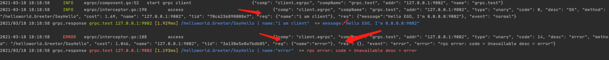

# gRPC
## 1 Example
[项目地址](https://github.com/gotomicro/ego/tree/master/examples/grpc)

ego版本：``ego@v0.5.3``

## 2 gRPC配置
```go
type Config struct {
    Addr                       string        // 连接地址，直连为127.0.0.1:9001，服务发现为etcd:///appname
    BalancerName               string        // 负载均衡方式，默认round robin
    OnFail                     string        // 失败后的处理方式，panic | error
    DialTimeout                time.Duration // 连接超时，默认3s
    ReadTimeout                time.Duration // 读超时，默认1s
    SlowLogThreshold           time.Duration // 慢日志记录的阈值，默认600ms
    Debug                      bool          // 是否开启调试，默认不开启，开启后并加上export EGO_DEBUG=true，可以看到每次请求，配置名、地址、耗时、请求数据、响应数据
    EnableBlock                bool          // 是否开启阻塞，默认开启
    EnableWithInsecure         bool          // 是否开启非安全传输，默认开启
    EnableMetricInterceptor    bool          // 是否开启监控，默认开启
    EnableTraceInterceptor     bool          // 是否开启链路追踪，默认开启
    EnableAppNameInterceptor   bool          // 是否开启传递应用名，默认开启
    EnableTimeoutInterceptor   bool          // 是否开启超时传递，默认开启
    EnableAccessInterceptor    bool          // 是否开启记录请求数据，默认不开启
    EnableAccessInterceptorReq bool          // 是否开启记录请求参数，默认不开启
    EnableAccessInterceptorRes bool          // 是否开启记录响应参数，默认不开启
}
```


## 3 优雅的Debug
通过开启``debug``配置和命令行的``export EGO_DEBUG=true``，
我们可以在测试环境里看到请求里的行号、配置名、请求地址、耗时、请求数据、响应数据


并且使用``Goland``同学，可以直接通过行号点击到对应的代码路径


## 4 直连gRPC
## 4.1 用户配置
```toml
[grpc.test]
debug = true # 开启后并加上export EGO_DEBUG=true，可以看到每次grpc请求，配置名、地址、耗时、请求数据、响应数据
addr = "127.0.0.1:9002"  
```

## 4.2 用户代码
配置创建一个 ``grpc`` 的配置项，其中内容按照上文配置进行填写。以上这个示例里这个配置key是``grpc.test``

代码中创建一个 ``gRPC`` 客户端， ``egrpc.Load("key").Build()``，代码中的 ``key`` 和配置中的 ``key`` 要保持一致。创建完 ``gRPC`` 客户端后， 将他添加到你所需要的Client里即可。

```go
package main

import (
	"context"
	"github.com/gotomicro/ego"
	"github.com/gotomicro/ego/client/egrpc"
	"github.com/gotomicro/ego/core/elog"
	"google.golang.org/grpc/examples/helloworld/helloworld"
)

func main() {
	if err := ego.New().Invoker(
		invokerGrpc,
		callGrpc,
	).Run(); err != nil {
		elog.Error("startup", elog.FieldErr(err))
	}
}

var grpcComp helloworld.GreeterClient

func invokerGrpc() error {
	grpcConn := egrpc.Load("grpc.test").Build()
	grpcComp = helloworld.NewGreeterClient(grpcConn.ClientConn)
	return nil
}

func callGrpc() error {
	_, err := grpcComp.SayHello(context.Background(), &helloworld.HelloRequest{
		Name: "i am client",
	})
	if err != nil {
		return err
	}

	_, err = grpcComp.SayHello(context.Background(), &helloworld.HelloRequest{
		Name: "error",
	})
	if err != nil {
		return err
	}
	return nil
}
```


## 5 使用ETCD的gRPC
## 5.1 用户配置
```toml
[grpc.test]
debug = true # 开启后并加上export EGO_DEBUG=true，可以看到每次grpc请求，配置名、地址、耗时、请求数据、响应数据
addr = "etcd:///name-srv"  
```

## 5.2 用户代码
配置创建一个 ``grpc`` 的配置项，其中内容按照上文配置进行填写。以上这个示例里这个配置key是``grpc.test``

代码中创建一个 ``gRPC`` 客户端， ``egrpc.Load("key").Build()``，代码中的 ``key`` 和配置中的 ``key`` 要保持一致。创建完 ``gRPC`` 客户端后， 将他添加到你所需要的Client里即可。

```go
package main

import (
	"context"
	"github.com/gotomicro/ego"
	"github.com/gotomicro/ego/core/elog"
	"github.com/gotomicro/ego-component/eetcd"
	"github.com/gotomicro/ego-component/eetcd/registry"
	"github.com/gotomicro/ego/client/egrpc"
	"github.com/gotomicro/ego/client/egrpc/resolver"
	"google.golang.org/grpc/examples/helloworld/helloworld"
)

func main() {
	if err := ego.New().Invoker(
		invokerGrpc,
		callGrpc,
	).Run(); err != nil {
		elog.Error("startup", elog.FieldErr(err))
	}
}

var grpcComp helloworld.GreeterClient

func invokerGrpc() error {
    // 必须注册在grpc前面
    resolver.Register("etcd",  registry.Load("registry").Build(registry.WithClientEtcd(eetcd.Load("etcd").Build())))

	grpcConn := egrpc.Load("grpc.test").Build()
	grpcComp = helloworld.NewGreeterClient(grpcConn.ClientConn)
	return nil
}

func callGrpc() error {
	_, err := grpcComp.SayHello(context.Background(), &helloworld.HelloRequest{
		Name: "i am client",
	})
	if err != nil {
		return err
	}

	_, err = grpcComp.SayHello(context.Background(), &helloworld.HelloRequest{
		Name: "error",
	})
	if err != nil {
		return err
	}
	return nil
}
```


## 6 使用K8S的gRPC
## 6.1 用户配置
```toml
[grpc.test]
debug = true # 开启后并加上export EGO_DEBUG=true，可以看到每次grpc请求，配置名、地址、耗时、请求数据、响应数据
addr = "k8s:///name-srv"  
```

## 6.2 用户代码
配置创建一个 ``grpc`` 的配置项，其中内容按照上文配置进行填写。以上这个示例里这个配置key是``grpc.test``

代码中创建一个 ``gRPC`` 客户端， ``egrpc.Load("key").Build()``，代码中的 ``key`` 和配置中的 ``key`` 要保持一致。创建完 ``gRPC`` 客户端后， 将他添加到你所需要的Client里即可。

```go
package main

import (
	"context"
	"github.com/gotomicro/ego"
	"github.com/gotomicro/ego/core/elog"
	"github.com/gotomicro/ego-component/ek8s"
	"github.com/gotomicro/ego-component/ek8s/registry"
	"github.com/gotomicro/ego/client/egrpc"
	"github.com/gotomicro/ego/client/egrpc/resolver"
	"google.golang.org/grpc/examples/helloworld/helloworld"
)

func main() {
	if err := ego.New().Invoker(
		invokerGrpc,
		callGrpc,
	).Run(); err != nil {
		elog.Error("startup", elog.FieldErr(err))
	}
}

var grpcComp helloworld.GreeterClient

func invokerGrpc() error {
    // 必须注册在grpc前面
 	resolver.Register("k8s", registry.Load("registry").Build(registry.WithClientKubernetes(ek8s.Load("k8s").Build())))

	grpcConn := egrpc.Load("grpc.test").Build()
	grpcComp = helloworld.NewGreeterClient(grpcConn.ClientConn)
	return nil
}

func callGrpc() error {
	_, err := grpcComp.SayHello(context.Background(), &helloworld.HelloRequest{
		Name: "i am client",
	})
	if err != nil {
		return err
	}

	_, err = grpcComp.SayHello(context.Background(), &helloworld.HelloRequest{
		Name: "error",
	})
	if err != nil {
		return err
	}
	return nil
}
```

## 7 使用gRPC的链路
### 7.1 用户配置
```toml
[trace.jaeger] # 启用链路的核心配置
	ServiceName = "client"
[grpc.test]
    debug = true # 开启后并加上export EGO_DEBUG=true，可以看到每次grpc请求，配置名、地址、耗时、请求数据、响应数据
    addr = "127.0.0.1:9002"
```
### 7.2 测试代码
[gRPC直连查看链路id](https://github.com/gotomicro/ego/tree/master/examples/grpc/direct)
#### 7.2.1 服务端链路信息


#### 7.2.2 客户端链路信息


## 8 开启客户端详细日志信息
### 8.1 测试代码
[gRPC查看详细信息](https://github.com/gotomicro/ego/tree/master/examples/grpc/direct)

### 8.2 用户配置
```toml
[grpc.test]
    debug = true # 开启后并加上export EGO_DEBUG=true，可以看到每次grpc请求，配置名、地址、耗时、请求数据、响应数据
    addr = "127.0.0.1:9002"
	enableAccessInterceptor=true             #  是否开启记录请求数据，默认不开启
    enableAccessInterceptorReq=true          # 是否开启记录请求参数，默认不开启
    enableAccessInterceptorRes=true          # 是否开启记录响应参数，默认不开启
```
#### 8.3 服务端详细信息



<Vssue title="Client-grpc" />
