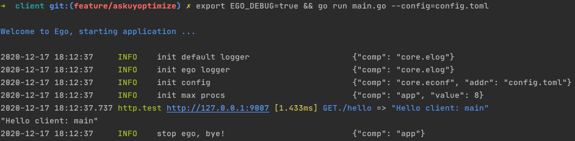

# HTTP
## 1 Example
[项目地址](https://github.com/gotomicro/ego/tree/master/examples/http)

ego版本：``ego@v0.5.3``

## 2 HTTP配置
```go
type Config struct {
    Addr                       string        // 连接地址
    Debug                      bool          // 是否开启调试，默认不开启，开启后并加上export EGO_DEBUG=true，可以看到每次请求，配置名、地址、耗时、请求数据、响应数据
    RawDebug                   bool          // 是否开启原生调试，默认不开启
    ReadTimeout                time.Duration // 读超时，默认2s
    SlowLogThreshold           time.Duration // 慢日志记录的阈值，默认500ms
    IdleConnTimeout            time.Duration // 设置空闲连接时间，默认90 * time.Second
    MaxIdleConns               int           // 设置最大空闲连接数
    MaxIdleConnsPerHost        int           // 设置长连接个数
    EnableTraceInterceptor     bool          // 是否开启链路追踪，默认开启
    EnableKeepAlives           bool          // 是否开启长连接，默认打开
    EnableAccessInterceptor    bool          // 是否开启记录请求数据，默认不开启
    EnableAccessInterceptorRes bool          // 是否开启记录响应参数，默认不开启
}
```

## 3 用户配置
```toml
[http.test]
addr = "http://127.0.0.1:9007" # 开启后并加上export EGO_DEBUG=true，可以看到每次http请求，配置名、地址、耗时、请求数据、响应数据
debug = true
```

## 4 优雅的Debug
通过开启``debug``配置和命令行的``export EGO_DEBUG=true``，我们就可以在测试环境里看到请求里的配置名、地址、耗时、请求数据、响应数据

当然你也可以开启``http``原生的调试，将``rawDebug``设置为``true``


## 5 用户代码
配置创建一个 ``http`` 的配置项，其中内容按照上文HTTP的配置进行填写。以上这个示例里这个配置key是``http.test``

代码中创建一个 ``HTTP`` 客户端， ``ehttp.Load("key").Build()``，代码中的 ``key`` 和配置中的 ``key`` 要保持一致。创建完 ``HTTP`` 客户端后， 将他添加到你所需要的Client里即可。

```go
package main

import (
	"fmt"
	"github.com/gotomicro/ego"
	"github.com/gotomicro/ego/client/ehttp"
	"github.com/gotomicro/ego/core/elog"
)

func main() {
	if err := ego.New().Invoker(
		invokerHTTP,
		callHTTP,
	).Run(); err != nil {
		elog.Error("startup", elog.FieldErr(err))
	}
}

var httpComp *ehttp.Component

func invokerHTTP() error {
	httpComp = ehttp.Load("http.test").Build()
	return nil
}

func callHTTP() error {
	info, err := httpComp.R().Get("/hello")
	if err != nil {
		return err
	}
	fmt.Println(info)
	return nil
}
```

<Vssue title="Client-http" />
