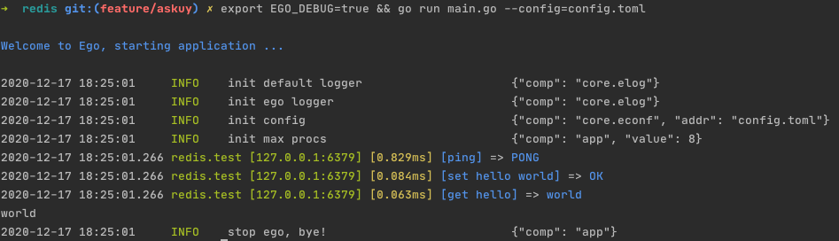

# Redis

## Example

[项目地址](https://github.com/gotomicro/ego-component/tree/master/eredis/examples/redis)

## Redis配置

``` go
type Config struct {
    Addrs                        []string      // Addrs 实例配置地址
    Addr                         string        // Addr stubConfig 实例配置地址
    Mode                       string        // Mode Redis模式 cluster|stub|sentinel
    MasterName                 string        // MasterName 哨兵主节点名称，sentinel模式下需要配置此项
    Password                     string        // Password 密码
    DB                           int           // DB，默认为0, 一般应用不推荐使用DB分片
    PoolSize                     int           // PoolSize 集群内每个节点的最大连接池限制 默认每个CPU10个连接
    MaxRetries                   int           // MaxRetries 网络相关的错误最大重试次数 默认8次
    MinIdleConns                 int           // MinIdleConns 最小空闲连接数
    DialTimeout                  time.Duration // DialTimeout 拨超时时间
    ReadTimeout                  time.Duration // ReadTimeout 读超时 默认3s
    WriteTimeout                 time.Duration // WriteTimeout 读超时 默认3s
    IdleTimeout                  time.Duration // IdleTimeout 连接最大空闲时间，默认60s, 超过该时间，连接会被主动关闭
    Debug                        bool          // Debug开关， 是否开启调试，默认不开启，开启后并加上export EGO_DEBUG=true，可以看到每次请求，配置名、地址、耗时、请求数据、响应数据
    ReadOnly                     bool          // ReadOnly 集群模式 在从属节点上启用读模式
    SlowLogThreshold             time.Duration // 慢日志门限值，超过该门限值的请求，将被记录到慢日志中
    OnFail                       string        // OnFail panic|error
    EnableMetricInterceptor      bool          // 是否开启监控，默认开启
    EnableAccessInterceptor      bool          // 是否开启，记录请求数据
    EnableAccessInterceptorReply bool          // 是否开启记录响应参数
    EnableAccessInterceptorReq   bool          // 是否开启记录请求参数
}
```

## 用户配置

```toml
# 常用的stub单实例配置示例
[redis.stub]
   debug = true # ego增加redis debug，打开后可以看到，配置名、地址、耗时、请求数据、响应数据
   mode = "stub" # 默认为stub单实例模式，可选"stub|cluster|sentinel"
   addr = "127.0.0.1:6379"

# cluster集群模式配置示例
[redis.cluster]
   debug = true
   mode = "cluster" # 设置为"cluster"模式，该模式下必须配置"addrs" 
   addrs = ["127.0.0.1:6379", "127.0.0.1:6380", "127.0.0.1:6381"]  # cluster模式下必须配置"addrs"

# sentinel哨兵模式配置示例
[redis.sentinel]
   debug = true
   mode = "sentinel" # 设置为"sentinel"模式，该模式下必须配置"addrs"和"masterName"
   addrs = ["127.0.0.1:26379", "127.0.0.1:26380", "127.0.0.1:26381"] # sentinel模式下必须配置"addrs"
   masterName = "my-sentinel-master-name" # sentinel 模式下必须配置"masterName"
```

## 优雅的Debug

通过开启 `debug` 配置和命令行的 `export EGO_DEBUG=true`，我们就可以在测试环境里看到请求里的配置名、地址、耗时、请求数据、响应数据



## 用户代码

::: tip
客户端组件均使用go mod子包管理，使用该组件，一定要使用下面的go get命令
:::

``` bash
go get github.com/gotomicro/ego-component/eredis
```

配置创建一个 `redis` 的配置项，其中内容按照上文配置进行填写。以上这个示例里这个配置key是`redis.test`

代码中创建一个 `redis` 实例 `eredis.Load("key").Build()`，代码中的 `key` 和配置中的 `key` 要保持一致。创建完 `redis` 实例后，就可以直接使用他对 `redis` 进行 `crud` 。

``` go
package main
     
import (
    "fmt"

    "github.com/gotomicro/ego"
    "github.com/gotomicro/ego-component/eredis"
    "github.com/gotomicro/ego/core/elog"
)

// export EGO_DEBUG=true && go run main.go --config=config.toml
func main() {
    err := ego.New().Invoker(
        invokerRedis,
        testRedis,
    ).Run()
    if err != nil {
        elog.Panic("startup", elog.FieldErr(err))
    }
}

var eredisStubClient *eredis.Component
var eredisClusterClient *eredis.Component
var eredisSentinelClient *eredis.Component

func invokerRedis() error {
    // 读取"redis.stub"配置，并初始化redis stub component实例
    eredisStubClient = eredis.Load("redis.stub").Build()
    // 读取"redis.cluster"配置，并初始化redis cluster component实例
    eredisClusterClient = eredis.Load("redis.cluster").Build()
    // 读取"redis.sentinel"配置，并初始化redis sentinel component实例
    eredisSentinelClient = eredis.Load("redis.sentinel").Build()
    return nil
}

func testRedis() error {
    // 使用redis stub component进行set、get操作
    err := eredisStubClient.Set("hello", "world", 0)
    if err != nil {
        log.Println(err)
    }
    str, err := eredisStubClient.GetString("hello")
    if err != nil {
        log.Println(err)
    }
    fmt.Println(str)

    // 使用redis cluster component进行set、get操作
    err := eredisClusterClient.Set("hello", "world", 0)
    if err != nil {
        log.Println(err)
    }
    str, err := eredisClusterClient.GetString("hello")
    if err != nil {
        log.Println(err)
    }
    fmt.Println(str)
    return nil

    // 使用redis sentinel component进行set、get操作
    err := eredisSentinelClient.Set("hello", "world", 0)
    if err != nil {
        log.Println(err)
    }
    str, err := eredisSentinelClient.GetString("hello")
    if err != nil {
        log.Println(err)
    }
    fmt.Println(str)
    return nil
}
```

<Vssue title="Client-redis" />
