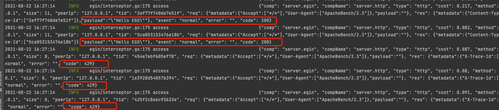
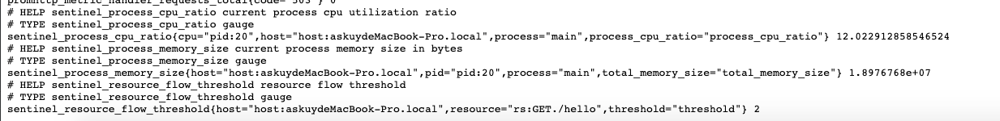
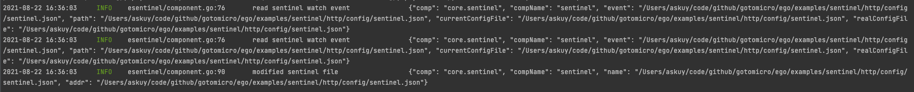

# Sentinel

## Example
[项目地址](https://github.com/gotomicro/ego/blob/master/examples/sentinel)
[官方文档](https://sentinelguard.io/zh-cn/docs/golang/flow-control.html)
ego版本：``ego@v0.6.4``

## Sentinel配置

```go
type Config struct {
  AppName       string `json:"appName"` // 应用名，默认从ego框架内部获取
  LogPath       string `json:"logPath"` // 日志路径，默认./logs
  FlowRulesFile string `json:"flowRulesFile"` // 限流配置路径
}
```

## Sentinel 限流配置

```go
type Rule struct {
  ID string
  Resource               string                 // 资源名，默认配置形式为Get./hello
  TokenCalculateStrategy TokenCalculateStrategy // 0 Direct，1 WarmUp，2 MemoryAdaptive
  ControlBehavior        ControlBehavior // 控制行为，0 Reject 请求直接拒绝，1 Throttling 请求限流排队
  Threshold        float64               // 1s内的QPS域值
  RelationStrategy RelationStrategy      // 0 CurrentResource 当前资源流控行为
  RefResource      string
  MaxQueueingTimeMs uint32
  WarmUpPeriodSec   uint32
  WarmUpColdFactor  uint32
  StatIntervalInMs uint32
  LowMemUsageThreshold  int64
  HighMemUsageThreshold int64
  MemLowWaterMarkBytes  int64
  MemHighWaterMarkBytes int64
}
```

一条流控规则主要由下面几个因素组成，我们可以组合这些元素来实现不同的限流效果：

* Resource：资源名，即规则的作用目标。
* TokenCalculateStrategy: 当前流量控制器的Token计算策略。Direct表示直接使用字段 Threshold 作为阈值；WarmUp表示使用预热方式计算Token的阈值。
* ControlBehavior: 表示流量控制器的控制策略；Reject表示超过阈值直接拒绝，Throttling表示匀速排队。
* Threshold: 表示流控阈值；如果字段 StatIntervalInMs 是1000(也就是1秒)，那么Threshold就表示QPS，流量控制器也就会依据资源的QPS来做流控。
* RelationStrategy: 调用关系限流策略，CurrentResource表示使用当前规则的resource做流控；AssociatedResource表示使用关联的resource做流控，关联的resource在字段
  RefResource 定义；
* RefResource: 关联的resource；
* WarmUpPeriodSec: 预热的时间长度，该字段仅仅对 WarmUp 的TokenCalculateStrategy生效；
* WarmUpColdFactor: 预热的因子，默认是3，该值的设置会影响预热的速度，该字段仅仅对 WarmUp 的TokenCalculateStrategy生效；
* MaxQueueingTimeMs: 匀速排队的最大等待时间，该字段仅仅对 Throttling ControlBehavior生效；
* StatIntervalInMs: 规则对应的流量控制器的独立统计结构的统计周期。如果StatIntervalInMs是1000，也就是统计QPS。

## HTTP限流
### 配置
```toml
[server.http]
host = "0.0.0.0"
port = 9007
enableAccessInterceptorReq = true
enableAccessInterceptorRes = true
enableSentinel = true # 打开限流配置开关
[server.governor]
host = "0.0.0.0"
port = 9003
[sentinel]
flowRulesFile = "./config/sentinel.json" # 设置限流配置路径
```
### 限流配置
设置资源名`GET./hello`1s请求为2个
```json
[
  {
    "resource": "GET./hello",
    "threshold": 2,
    "tokenCalculateStrategy": 0,
    "controlBehavior": 0
  }
]
```

### 启动服务
```go
package main

import (
	"github.com/gin-gonic/gin"
	"github.com/gotomicro/ego"
	"github.com/gotomicro/ego/core/elog"
	"github.com/gotomicro/ego/server/egin"
	"github.com/gotomicro/ego/server/egovernor"
)

// export EGO_DEBUG=true && go run main.go
// ab -n 10 -c 10  http://127.0.0.1:9007/hello，可以看到429，说明限流
func main() {
	if err := ego.New().Serve(func() *egin.Component {
		server := egin.Load("server.http").Build()
		server.GET("/hello", func(c *gin.Context) {
			c.JSON(200, "Hello EGO")
			return
		})
		return server
	}(),
		egovernor.Load("server.governor").Build(),
	).Run(); err != nil {
		elog.Panic("startup", elog.FieldErr(err))
	}
}
```

### 测试限流
```bash
ab -n 10 -c 10  http://127.0.0.1:9007/hello
```

可以看到按照sentinel的限流指标只通过了2条请求，其余请求全部拒绝，状态码响应429

### 测试监控数据
```bash
curl  http://127.0.0.1:9003/metics
```

官方监控还不全，后续等官方新的PR https://github.com/alibaba/sentinel-golang/pull/382合并后，可以看到更完整限流监控

### 动态修改限流参数
更改`sentinel.json`里的`threshold`，`ego`会实时监听，并更新限流数据，同时`prometheus`监控数据都会做相应更改


### 限流可选参数
如果想自定义资源名或者自定义限流的错误码信息，可以使用`egin`里的`options`参数。
```go
func main() {
	if err := ego.New().Serve(func() *egin.Component {
		server := egin.Load("server.http").Build(
			egin.WithSentinelResourceExtractor(func(ctx *gin.Context) string {
				return ctx.Request.Method + "." + ctx.FullPath()
			}),
			egin.WithSentinelBlockFallback(func(ctx *gin.Context) {
				ctx.AbortWithStatusJSON(429, gin.H{"msg": "too many requests"})
			}),
		)
		server.GET("/hello", func(c *gin.Context) {
			c.JSON(200, "Hello EGO")
			return
		})
		return server
	}(),
		egovernor.Load("server.governor").Build(),
	).Run(); err != nil {
		elog.Panic("startup", elog.FieldErr(err))
	}
}
```