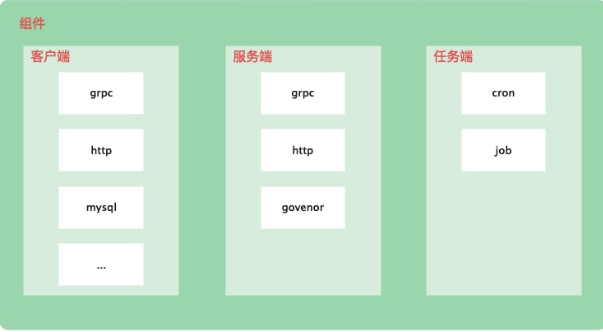

# 万物皆可组件
## 什么是组件

这里的组件主要是针对一些依赖项目，比如gin，比如grpc等等，我们在这里实现了一系列的标准化组件：https://github.com/gotomicro/ego-component

在ego中，我们通过interface给出了如何成为一个组件，所有通用组件都需要实现这些方法来保证丝滑的接入ego
```go
type Component interface {
    // Name defines component's unique name, such as "my.grpc.server".
    Name() string
    // PackageName presents component's package name, such as "server.grpc".
    PackageName() string
    // Init defines component's Instantiation procedure.
    Init() error
    // Start defines component's start procedure.
    Start() error
    // Stop defines component's stop procedure.
    Stop() error
}
```

## 注册组件
为了方便ego进行组件的管理, 相关的组件需要首先在ego中进行注册

如图所示，注册成为ego的组件有多种方式，换一种说法就是，ego中维护了多个可维护组件生命周期的场所

我们挨个来用例子介绍将中间件注册成为ego管理的组件

### Server
这里我们继续以hello的例子举例
```go
func main() {
    if err := ego.New().Serve(func() *egin.Component {
        // egin组件加载
        server := egin.Load("server.http").Build()
        server.GET("/hello", func(ctx *gin.Context) {
            ctx.JSON(200, "Hello EGO")
            return
        })
        return server
    }()).Run(); err != nil {
        elog.Panic("startup", elog.FieldErr(err))
    }
}
```

Serve完成了egin组件的注册,将组件绑定进ego.servers中
### Orderserver
我们继续以Hello的gin组件举例:
```go
func main() {
    if err := ego.New().OrderServe(func() *egin.Component {
        // egin组件加载
        server := egin.Load("server.http").Build()
        server.GET("/hello", func(ctx *gin.Context) {
            ctx.JSON(200, "Hello EGO")
            return
        })
        return server
    }()).Run(); err != nil {
        elog.Panic("startup", elog.FieldErr(err))
    }
}
```
ego.OrderServe完成了egin组件的注册,将组件绑定到ego.orderServers中
### ReloadServer
这里我们继续以hello的例子举例
```go
func main() {
    if err := ego.New().ReloadServe(func() *egin.Component {
        // egin组件加载
        server := egin.Load("server.http").Build()
        server.GET("/hello", func(ctx *gin.Context) {
            ctx.JSON(200, "Hello EGO")
            return
        })
        return server
    }()).Run(); err != nil {
        elog.Panic("startup", elog.FieldErr(err))
    }
}
```

ego.ReloadServe完成了egin组件的注册,将组件绑定到ego.reloadServers中
### Cron
```go
func main() {
    if err := ego.New().Cron(func() *egin.Component {
        // ecorn组件加载
        cron := ecron.Load("cron.clearExpiredDemo").Build()
        return cron
    }()).Run(); err != nil {
        elog.Panic("startup", elog.FieldErr(err))
    }
}
```

ego.Cron完成了ecron组件的注册,将组件绑定到ego.corns中
### Job
```go
func main() {
    if err := ego.New().Cron(func() *egin.Component {
        // ejob组件加载
        return ejob.DefaultContainer().Build()
        }()).Run(); err != nil {
        elog.Panic("startup", elog.FieldErr(err))
    }
}
```


ego.Job完成了ejob组件的注册,将组件绑定到ego.jobs中
## 组件生命周期

组件通过上述几种方式完成了注册之后,就会被ego直接进行统一管理,进而实现统一的生命周期