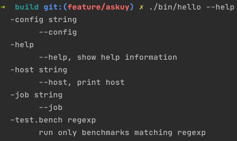
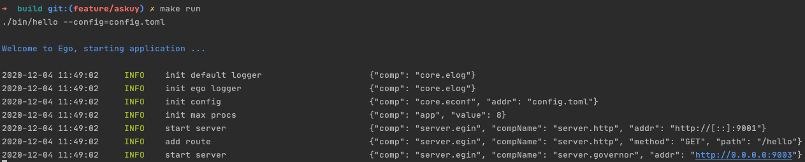

# 编译
## Example
[项目地址](https://github.com/gotomicro/ego/tree/master/example/build)

使用EGO框架的应用会在编译期注入许多必要信息，方便后续排查问题。该方案被大量Go应用所使用，例如istio、prometheus等。我们使用的编译脚本核心内容如下所示。

## 编译脚本
```bash
go build -o bin/hello -pkgdir=/Users/askuy/go/pkg/linux_amd64 -ldflags -extldflags -static  -X github.com/gotomicro/ego/core/eapp.appName=hello -X github.com/gotomicro/ego/core/eapp.buildVersion=b0807b91aca95b6eb6daafa9195c467fac0c350b-dirty -X github.com/gotomicro/ego/core/eapp.buildAppVersion=b0807b91aca95b6eb6daafa9195c467fac0c350b-dirty -X github.com/gotomicro/ego/core/eapp.buildStatus=Modified -X github.com/gotomicro/ego/core/eapp.buildTag= -X github.com/gotomicro/ego/core/eapp.buildUser=askuy -X github.com/gotomicro/ego/core/eapp.buildHost=askuydeMacBook-Pro.local -X github.com/gotomicro/ego/core/eapp.buildTime=2020-12-04--11:34:55
```


## 查看编译版本信息


## 查看帮助文档
输入 ``--help`` 可以看到应用支持的指令



## 查看运行时信息
我们启动服务



请求治理端口的/metrics接口，可以看到 ``ego_build_info`` 的信息，这里会将编译信息放入到 ``prometheus`` 中，并且还会把运行时的环境信息和启动时间也加入进来。
```
# HELP ego_build_info 
# TYPE ego_build_info gauge
ego_build_info{app_version="b0807b91aca95b6eb6daafa9195c467fac0c350b-dirty",build_time="2020-12-04 11:48:35",ego_version="0.1.0",go_version="go1.15.2",mode="dev",name="hello",region="huabei",start_time="2020-12-04 11:49:02",zone="ali-3"} 1.607053742679e+12
```

<Vssue title="Build" />
