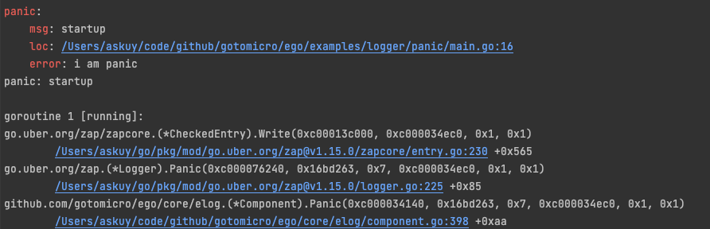
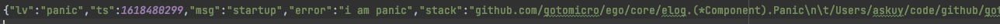

# 日志
## 1 Example
* [调试模式终端显示日志](https://github.com/gotomicro/ego/tree/master/examples/logger/console)
* [正式环境终端显示日志](https://github.com/gotomicro/ego/tree/master/examples/logger/stderr)
* [文本显示日志](https://github.com/gotomicro/ego/tree/master/examples/logger/file)
* [日志直接输出到ali sls](https://github.com/gotomicro/ego/tree/master/examples/logger/ali)
* [日志动态修改级别](https://github.com/gotomicro/ego/tree/master/examples/logger/watch)
* [日志Panic高亮双输出](https://github.com/gotomicro/ego/tree/master/examples/logger/panic)

ego版本：``ego@v0.5.3``

## 2 日志配置
框架在处理的日志区分为框架日志和业务日志，了解日志，请阅读日志和错误处理。

日志配置的数据结构如下
```go
// Config ...
type Config struct {
    Debug                     bool          // 是否双写至文件控制日志输出到终端
    Level                     string        // 日志初始等级，默认info级别
    Dir                       string        // [fileWriter]日志输出目录，默认logs
    Name                      string        // [fileWriter]日志文件名称，默认框架日志ego.sys，业务日志default.log
    MaxSize                   int           // [fileWriter]日志输出文件最大长度，超过改值则截断，默认500M
    MaxAge                    int           // [fileWriter]日志存储最大时间，默认最大保存天数为7天
    MaxBackup                 int           // [fileWriter]日志存储最大数量，默认最大保存文件个数为10个
    RotateInterval            time.Duration // [fileWriter]日志轮转时间，默认1天
    EnableAddCaller           bool          // 是否添加调用者信息，默认不加调用者信息
    EnableAsync               bool          // 是否异步，默认异步
    FlushBufferSize           int           // 缓冲大小，默认256 * 1024B
    FlushBufferInterval       time.Duration // 缓冲时间，默认5秒
    Writer                    string        // 使用哪种Writer，可选[file|ali|stderr]，默认file
    AliAccessKeyID            string        // [aliWriter]阿里云sls AKID，必填
    AliAccessKeySecret        string        // [aliWriter]阿里云sls AKSecret，必填
    AliEndpoint               string        // [aliWriter]阿里云sls endpoint，必填
    AliProject                string        // [aliWriter]阿里云sls Project名称，必填
    AliLogstore               string        // [aliWriter]阿里云sls logstore名称，必填
    AliAPIBulkSize            int           // [aliWriter]阿里云sls API单次请求发送最大日志条数，最少256条，默认256条
    AliAPITimeout             time.Duration // [aliWriter]阿里云sls API接口超时，默认3秒
    AliAPIRetryCount          int           // [aliWriter]阿里云sls API接口重试次数，默认3次
    AliAPIRetryWaitTime       time.Duration // [aliWriter]阿里云sls API接口重试默认等待间隔，默认1秒
    AliAPIRetryMaxWaitTime    time.Duration // [aliWriter]阿里云sls API接口重试最大等待间隔，默认3秒
    AliAPIMaxIdleConnsPerHost int           // [aliWriter]阿里云sls 单个Host HTTP最大空闲连接数，应当大于AliApiMaxIdleConns
    AliAPIMaxIdleConns        int           // [aliWriter]阿里云sls HTTP最大空闲连接数
    AliAPIIdleConnTimeout     time.Duration // [aliWriter]阿里云sls HTTP空闲连接保活时间
}
```

## 3 终端显示日志
在运行程序前开启环境变量 ``EGO_DEBUG=true``，可以把所有日志输出到终端。并且开启了该指令后，日志的时间变成 ``time.Time`` 数据结构。

```go
package main

import (
	"github.com/gotomicro/ego"
	"github.com/gotomicro/ego/core/elog"
)

//  export EGO_DEBUG=true && go run main.go
func main() {
	err := ego.New().Invoker(func() error {
		elog.Info("logger info", elog.String("gopher", "ego"), elog.String("type", "command"))
		return nil
	}).Run()
	if err != nil {
		elog.Panic("startup", elog.Any("err", err))
	}
}
```

## 4 文件显示日志
当``EGO_DEBUG`` 环境变量不存在或者``EGO_DEBUG=false``的时候，日志默认输出到 logs 目录下。
```go
package main

import (
	"github.com/gotomicro/ego"
	"github.com/gotomicro/ego/core/elog"
)

//  export EGO_DEBUG=false && go run main.go
func main() {
	err := ego.New().Invoker(func() error {
		elog.Info("logger info", elog.String("gopher", "ego"), elog.String("type", "command"))
		return nil
	}).Run()
	if err != nil {
		elog.Panic("startup", elog.Any("err", err))
	}
}
```

## 5 动态日志级别
框架里自带的框架日志和业务日志都默认支持动态更改日志级别。当程序启动后，你可以在配置文件里更改lv的级别从info改为debug，就可以看到动态生效的debug日志，该方法非常利于研发排查线上问题，倡导大家线下多打debug日志，线上用info级别日志，出现线上问题可以改变日志级别，快速排查问题。

```toml
[logger.default]
    level = "info"
```

```go
package main

import (
	"github.com/gotomicro/ego"
	"github.com/gotomicro/ego/core/elog"
	"time"
)

//  export EGO_DEBUG=true && go run main.go --config=config.toml
func main() {
	err := ego.New(ego.WithHang(true)).Invoker(func() error {
		go func() {
			for {
				elog.Info("logger info", elog.String("gopher", "ego1"), elog.String("type", "file"))
				elog.Debug("logger debug", elog.String("gopher", "ego2"), elog.String("type", "file"))
				time.Sleep(1 * time.Second)
			}
		}()
		return nil
	}).Run()
	if err != nil {
		elog.Panic("startup", elog.Any("err", err))
	}
}
```

## 6 正式环境Panic日志和终端输出高亮
我们在使用k8s的时候，如果遇到Panic情况，会将panic记录到日志信息，同时也将panic信息高亮输出到终端，方便快速定位
* 命令行高亮输出


  
* 日志输出



## 7 日志字段
EGO的字段是确定类型的，通过正交查询方式，减少索引字段个数，同时方便创建索引。后续字段类型尽量像[opentrace](https://github.com/opentracing-contrib/opentracing-specification-zh/blob/master/semantic_conventions.md)靠拢

|名称|类型|描述|
| --- | --- | --- |
|lv|string|日志级别|
|ts	|string|时间戳|
|msg|string|日志信息|
|app|string|应用名称|
|iid|string|应用实例id|
|tid|string|请求trace id|
|color|string|染色|
|comp|string|类库或组件。如 "grpc", "http", "redis".|
|compName|string|组件配置key作为唯一标识|
|addr|	string|	依赖的实例名称。以mysql为例，"dsn = "root:root@tcp(127.0.0.1:3306)/ego?charset=utf8"，addr为 "127.0.0.1:3306".|
|cost|	int|	耗时时间|
|code|	int|	用户侧响应的状态码|
|meth|	string|	对于redis是command、对于http是url、对于mysql是sql|
|host|	string|	主机名|
|ip|	string|	主机IP|
|peerApp|	string|	对端应用名称|
|peerHost|	string|	对端主机名|
|errKind|	string|	错误类型，用于收敛|
|err|	string|	错误信息|

## 日志
* 慢日志
* 错误日志

