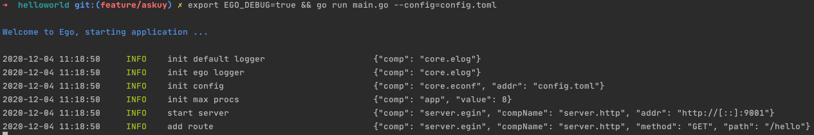

# 快速开始
## Example
[项目地址](https://github.com/gotomicro/ego/tree/master/example/helloworld)

## HelloWorld
```Go
package main
import (
   "github.com/gin-gonic/gin"
   "github.com/gotomicro/ego"
   "github.com/gotomicro/ego/core/elog"
   "github.com/gotomicro/ego/server"
   "github.com/gotomicro/ego/server/egin"
)
//  export EGO_DEBUG=true && go run main.go --config=config.toml
func main() {
   if err := ego.New().Serve(func() *egin.Component {
      server := egin.Load("server.http").Build()
      server.GET("/hello", func(ctx *gin.Context) {
         ctx.JSON(200, "Hello Ego")
         return
      })
      return server
   }()).Run(); err != nil {
      elog.Panic("startup", elog.Any("err", err))
   }
}
```

## 使用命令行运行
```bash
export EGO_DEBUG=true # 默认日志输出到logs目录，开启后日志输出到终端
go run main.go --config=config.toml
```


如下所示



这个时候我们可以发送一个指令，得到如下结果

```bash
➜  helloworld git:(master) ✗ curl http://127.0.0.1:9001/hello
"Hello Ego"%  
```

<Vssue title="快速开始" />
