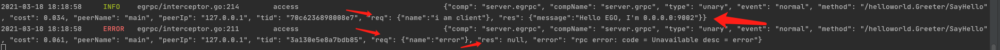

# gRPC服务
## 1 Example
[项目地址](https://github.com/gotomicro/ego/tree/master/examples/server/http)

ego版本：``ego@v0.3.14``

## 2 gRPC配置
```go
type Config struct {
	Host                       string        // IP地址，默认0.0.0.0
	Port                       int           // Port端口，默认9002
	Deployment                 string        // 部署区域
	Network                    string        // 网络类型，默认tcp4
	EnableMetricInterceptor    bool          // 是否开启监控，默认开启
	EnableTraceInterceptor     bool          // 是否开启链路追踪，默认开启
	SlowLogThreshold           time.Duration // 服务慢日志，默认500ms
	EnableAccessInterceptorReq bool          // 是否开启记录请求参数，默认不开启
	EnableAccessInterceptorRes bool          // 是否开启记录响应参数，默认不开启
	EnableLocalMainIP          bool          // 自动获取ip地址
}
```

## 3 普通服务
### 3.1 用户配置
```toml
[server.grpc]
  host = "127.0.0.1"
  port = 9002
```

### 3.2 用户代码
配置创建一个 ``grpc`` 的配置项，其中内容按照上文配置进行填写。以上这个示例里这个配置key是``server.grpc``

代码中创建一个 ``gRPC`` 服务， egrpc.Load("{{你的配置key}}").Build()，代码中的 ``key`` 和配置中的 ``key`` 要保持一致。创建完 ``gRPC`` 服务后， 将他添加到 ``ego new`` 出来应用的 ``Serve`` 方法中，之后使用的方法和 ``gRPC`` 就完全一致。

```go
package main

import (
	"context"
	"github.com/gotomicro/ego"
	"github.com/gotomicro/ego/core/elog"
	"github.com/gotomicro/ego/server"
	"github.com/gotomicro/ego/server/egrpc"
	"google.golang.org/grpc/examples/helloworld/helloworld"
)

//  export EGO_DEBUG=true && go run main.go --config=config.toml
func main() {
	if err := ego.New().Serve(func() server.Server {
		server := egrpc.Load("server.grpc").Build()
		helloworld.RegisterGreeterServer(server.Server, &Greeter{})
		return server
	}()).Run(); err != nil {
		elog.Panic("startup", elog.Any("err", err))
	}
}

type Greeter struct {
	server *egrpc.Component
}

func (g Greeter) SayHello(context context.Context, request *helloworld.HelloRequest) (*helloworld.HelloReply, error) {
	return &helloworld.HelloReply{
		Message: "Hello EGO, I'm " + g.server.Address(),
	}, nil
}
```

## 4 开启链路的服务
### 4.1 用户配置
```toml
[trace.jaeger] # 启用链路的核心配置
[server.grpc]
  host = "127.0.0.1"
  port = 9002
```
### 4.2 测试代码
[gRPC直连查看链路id](https://github.com/gotomicro/ego/tree/master/examples/grpc/direct)
#### 4.2.1 服务端链路信息


#### 4.2.2 客户端链路信息


## 5 开启服务端详细日志信息
### 5.1 测试代码
[gRPC查看详细信息](https://github.com/gotomicro/ego/tree/master/examples/grpc/direct)

### 5.2 用户配置
```toml
[server.grpc]
  host = "127.0.0.1"
  port = 9002
  enableAccessInterceptorReq=true          # 是否开启记录请求参数，默认不开启
  enableAccessInterceptorRes=true          # 是否开启记录响应参数，默认不开启
```
#### 5.3 服务端详细信息



<Vssue title="Server-grpc" />