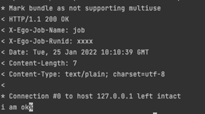

# 短时任务Job
## 背景
通常我们有许多程序是短时任务，执行一下就结束。这种场景通常有以下三种方式：
* 执行某个一次性任务，例如：执行程序的安装，或者mock数据
* 将生命周期托管给例如k8s job或者xxljob，由他们控制job的执行时间，执行二进制
* 通过定时任务来调用某个job http接口

## 最简单的Job
### Example
[项目地址](https://github.com/gotomicro/ego/tree/master/examples/task/job)

如果命令行参数里有 ``--job`` ，那么框架会优先执行这个 ``job``，停止所有的 ``server`` 和  ``cron`` 。 ``job`` 可以执行一个，也可以执行多个。执行一个方式 ``--job=jobname`` ，执行多个方式，用逗号分割 ``jobname``，例如： ``--job=jobname1,jobname2,jobname3``

```go
package main

import (
	"errors"
	"fmt"
	"go.uber.org/zap"
	"github.com/gotomicro/ego"
	"github.com/gotomicro/ego/core/elog"
	"github.com/gotomicro/ego/core/etrace"
	"github.com/gotomicro/ego/task/ejob"
)

// export EGO_DEBUG=true && go run main.go --job=job1
func main() {
	if err := ego.New().Job(
		ejob.Job("job1", job1),
		ejob.Job("job2", job2),
	).Run(); err != nil {
		elog.Error("start up", zap.Error(err))
	}
}

func job1(ctx ejob.Context) error {
	fmt.Println("i am job runner, traceId: ", etrace.ExtractTraceID(ctx.Ctx))
	return nil
}

func job2(ctx ejob.Context) error {
	fmt.Println("i am error job runner, traceId: ", etrace.ExtractTraceID(ctx.Ctx))
	return errors.New("i am error")
}
``` 

## HTTP的Job
### Example
[项目地址](https://github.com/gotomicro/ego/tree/master/examples/task/httpjob)


注册Job后，可以通过内网的治理服务得到job的信息
```bash
~ curl http://ip:port/job/list
~ ["job"]
```

### 1 用接口调用Job服务
```bash
~ export EGO_DEBUG=true && go run main.go --config=config.toml # 启动服务
~ curl -v -XPOST -d '{"username":"ego"}' -H 'X-Ego-Job-Name:job' -H 'X-Ego-Job-RunID:xxxx' -H 'test=1' http://127.0.0.1:9003/jobs ## 调用服务
```
#### 入参
* X-Ego-Job-Name：用于查找job的名称，必传
* X-Ego-Job-RunID：用于记录此次job的执行ID号，请保证唯一，必传
* Data： 用户自行传入，可选

#### 响应
* 状态码：正确返回200，参数错误返回400
* Header：将入参的 X-Ego-Job-Name，X-Ego-Job-RunID 的数据返回
* 参数错误：返回400，并会返回X-Ego-Job-Err的header错误


  
#### 成功响应



### 2 用命令行模拟HTTP调用Job服务
```bash
export EGO_DEBUG=true && go run main.go --config=config.toml --job=job --job-data='{"username":"ego"}' --job-header='test=1'
```
#### 入参
* --job：任务名称
* --job-data: 模拟HTTP data
* --job-header: 模拟HTTP header，--job-header='test=1;test2=2'

#### 响应
看job的执行日志，是否有error信息

### 代码
```go
package main

import (
	"encoding/json"
	"fmt"
	"io/ioutil"

	"github.com/gotomicro/ego"
	"github.com/gotomicro/ego/core/elog"
	"github.com/gotomicro/ego/server/egovernor"
	"github.com/gotomicro/ego/task/ejob"
	"go.uber.org/zap"
)

// 如果是Job 命令行执行  export EGO_DEBUG=true && go run main.go --config=config.toml --job=job --job-data='{"username":"ego"}' --job-header='test=1'
// 如果是Job HTTP执行  1 export EGO_DEBUG=true && go run main.go --config=config.toml
// 如果是Job HTTP执行  2 curl -v -XPOST -d '{"username":"ego"}' -H 'X-Ego-Job-Name:job' -H 'X-Ego-Job-RunID:xxxx' -H 'test=1' http://127.0.0.1:9003/jobs
func main() {
	if err := ego.New().Job(
		ejob.Job("job", job),
	).Serve(
		egovernor.Load("server.governor").Build(),
	).Run(); err != nil {
		elog.Error("start up", zap.Error(err))
	}
}
type data struct {
	Username string
}
func job(ctx ejob.Context) error {
	bytes, _ := ioutil.ReadAll(ctx.Request.Body)
	d := data{}
	_ = json.Unmarshal(bytes, &d)
	fmt.Println(d.Username)
	fmt.Println(ctx.Request.Header.Get("test"))
	ctx.Writer.Write([]byte("i am ok"))
	return nil
}

```


<Vssue title="Task-job" />