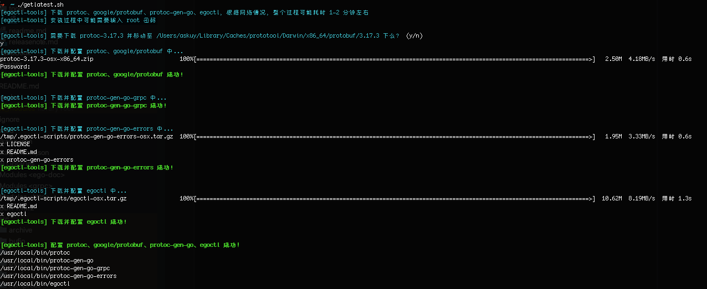

## 下载安装工具


## Proto工具执行原理
生成三个go文件，struct的pb文件，gRPC的pb文件，error的pb文件。
```bash
# 生成struct的pb文件
/usr/local/bin/protoc -I /usr/local/include -I {your proto directory} --go_out={output directory}
```

```bash
# 生成gRPC的pb文件
/usr/local/bin/protoc -I /usr/local/include -I {your proto directory} --go-grpc_out={output directory}
```

```bash
# 生成error的pb文件
/usr/local/bin/protoc -I /usr/local/include -I {your error proto file} --go-errors_out={output directory}
```

## 生成文件展示


* 链路
* 微服务gRPC调用
* 限流  
* 单元测试
* protobuf
* docker compose unix domain socket