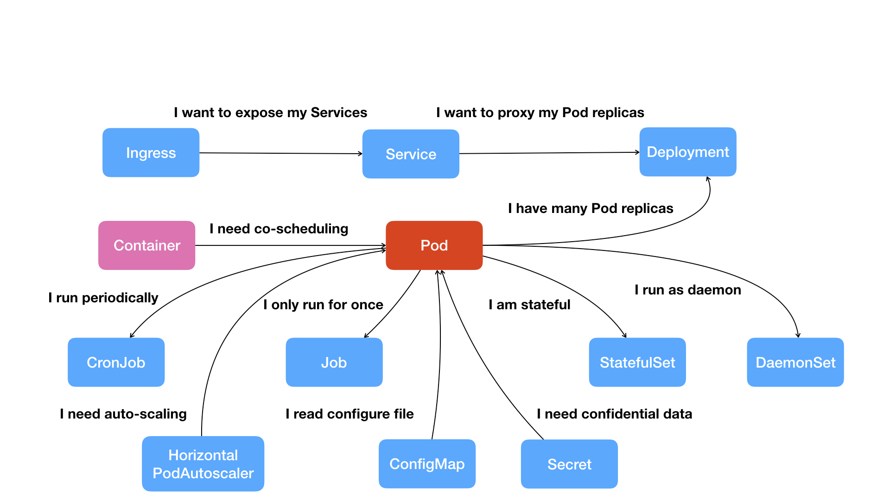

# K8S介绍
来自极客时间专栏

我们从容器这个最基础的概念出发，首先遇到了容器间“紧密协作”关系的难题，于是就扩展到了 Pod；有了 Pod 之后，我们希望能一次启动多个应用的实例，这样就需要 Deployment 这个 Pod 的多实例管理器；而有了这样一组相同的 Pod 后，我们又需要通过一个固定的 IP 地址和端口以负载均衡的方式访问它，于是就有了 Service。

Pod 就是 Kubernetes 世界里的“应用”；而一个应用，可以由多个Container组成。
