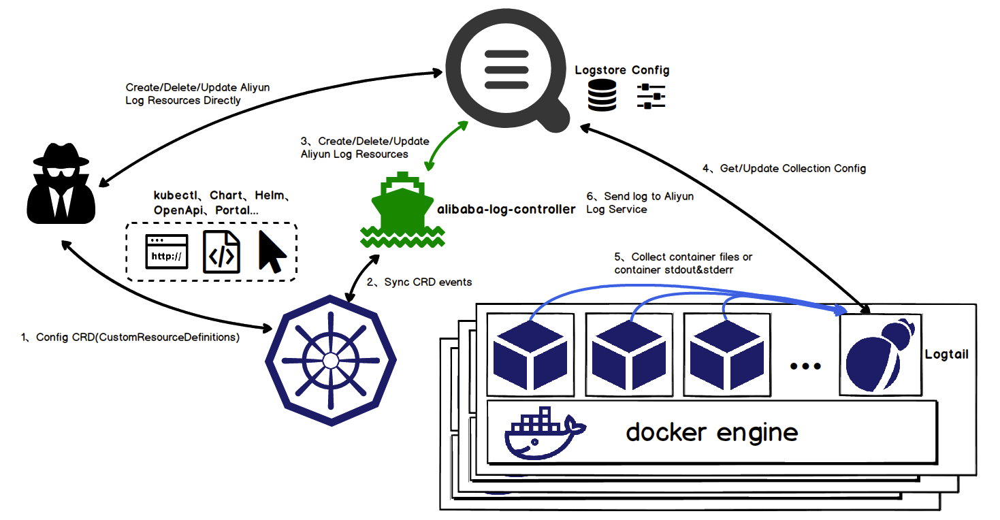

## 如何玩好日志

* 采集日志
* 日志规范
* 日志收敛
* 日志trace

### 采集日志

DockerEngine 本身具有 LogDriver 功能，可通过配置不同的 LogDriver 将容器的 stdout 通过 DockerEngine 写入到远端存储，以此达到日志采集的目的。

* 这种方式的可定制化、灵活性、资源隔离性都很低，一般不建议在生产环境中使用；
* 业务直写是在应用中集成日志采集的 SDK，通过 SDK 直接将日志发送到服务端。这种方式省去了落盘采集的逻辑，也不需要额外部署 Agent，对于系统的资源消耗最低，但由于业务和日志 SDK
  强绑定，整体灵活性很低，一般只有日志量极大的场景中使用；
* DaemonSet 方式在每个 node 节点上只运行一个日志 agent，采集这个节点上所有的日志。DaemonSet 相对资源占用要小很多，但扩展性、租户隔离性受限，比较适用于功能单一或业务不是很多的集群；
* Sidecar 方式为每个 POD 单独部署日志 agent，这个 agent 只负责一个业务应用的日志采集。Sidecar 相对资源占用较多，但灵活性以及多租户隔离性较强，建议大型的 K8s 集群或作为 PaaS
  平台为多个业务方服务的集群使用该方式。

总结下来：

* DockerEngine 直写一般不推荐；
* 业务直写推荐在日志量极大的场景中使用；
* DaemonSet 一般在中小型集群中使用；
* Sidecar 推荐在超大型的集群中使用。

阿里云K8S采集日志方式如下所示：

### EGO的日志说明

* 推荐采用DaemonSet方式
* 支持三种日志输出方式
    * 文件（默认）
    * 终端（需要改日志输出方式）
    * 直接写入到数据源
* 日志区分
    * ego.sys      (框架日志)
    * default.log （业务日志）

#### 日志等级
日志等级是用来区分日志对应事件严重程度的说明，这是所有日志中必须具备的一个选项。EGO采用的是zap的日志等级方式：
* Debug日志：用于线下调试的日志信息，用于分析应用执行逻辑，线上应用切勿开启；
* Info日志：应用执行过程中的详细信息，一般通过该信息可以看到每个请求的主要执行过程；
* Warn日志：潜在的危险或值得关注的信息（比较核心的路径）；
* Error日志：非预期中的错误，此种错误可能导致部分系统异常但不会影响核心业务和系统正常运行；
* DPanic日志:
* Panic日志: 此种错误可能导致部分系统异常，可能会影响核心业务和系统正常运行，遇到此种错误应当立即报警并人工介入处理；
* Fatal日志：用来输出非常严重或预期中不会发生的错误，遇到此种错误应当立即报警并人工介入处理；

### 引用

* https://reading.developerlearning.cn/reading/29-2019-01-23-opentracing-jaeger-in-go/
* http://bigbully.github.io/Dapper-translation/
* https://blog.csdn.net/yunqiinsight/article/details/80134045
* https://www.jianshu.com/p/752c17eb33f3
* https://www.jaegertracing.io/docs/1.14/sampling/

