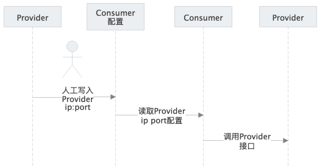

# 6 服务注册
## 6.1 术语
- 注册中心 registry
- 服务 service
- 服务元数据 service metadata
- 服务提供方 provider
- 服务消费方 consumer
- 名字 name，标示应用唯一性的名字
- 地址 ip
- 端口 port

## 6.2 背景
当我们的服务规模数量比较小的时候，我们通常都会在应用中使用配置文件去调用服务。例如某个consumer需要通过provider获取用户信息。我们可以将这个行为拆解为三个步骤

- 人工将provider的ip、port信息填入到consumer的配置
- consumer根据配置里的provider name，获取其ip port
- 调用provider的ip port的用户方法，拿到用户数据。



但是当集群规模达到一定量级之后，如果仍然采用这种配置方式去寻找服务，会让研发陷入到无尽的配置中，并且这种人工配置是不可靠的，会因为配置错误，导致服务不可访问，影响线上服务的稳定性。


为了减少这种繁琐的人工配置，因此我们需要Consumer能够动态的感知到Provider的地址。如果Provider在启动的时候将自己的名字、ip、port写入到中间件，那么Consumer就可以通过该中间件获取到Provider信息。这种能够提供注册服务信息、获取服务信息的中间件，我们称之为注册中心。缺图。


目前服务注册业界有多种方式，如下所示：

- Provider通过框架的sdk，将name、ip、port写入到注册中心，consumer访问provider，通过name，获取ip port，例如**ego**。
- 通过边车模式，拿到Provider的name、ip、port写入到注册中心，consumer访问provider，通过name，获取ip port，例如**istio**。
- 通过边车模式，将name、ip写入到注册中心，dns关联上ip，consumer访问provider，通过name，获取ip。例如k8s的**service**。

## 6.3 服务注册原理
在微服务架构下，主要有三种角色：服务提供者（RPC Server）、服务消费者（RPC Client）和服务注册中心（Registry），三者的交互关系请看下面这张图。

- RPC Server 提供服务，在启动时，根据服务的编译和配置信息，向 Registry 注册服务，并向 Registry 定期发送心跳汇报存活状态。
- RPC Client 调用服务，在启动时，根据配置文件的信息，向 Registry 订阅服务，把 Registry 返回的服务节点列表缓存在本地内存中，并与 RPC Sever 建立连接。
- 当 RPC Server 节点发生变更时，Registry 会同步变更，RPC Client 感知后会刷新本地内存中缓存的服务节点列表。
- RPC Client 从本地缓存的服务节点列表中，基于负载均衡算法选择一台 RPC Sever 发起调用。


## 6.4 服务注册概念
我们刚才讲到Consumer能够通过Provider的name获取他的ip port信息，这些信息确定一个服务的基本情况是远远不够的。我们通常会在注册信息写入以下信息：

| 名称 | 英文 | 示例 | 类型 |
| --- | --- | --- | --- |
| 环境 | env | dev | 环境变量 |
| 地区 | region | beijing | 环境变量 |
| 可用区 | zone | zone1 | 环境变量 |
| 地址 | ip | 192.168.1.1 | 环境变量 |
| 端口 | port | 8080 | 环境变量 |
| 协议 | scheme | gRPC | 配置变量 |
| 权重 | weight | 100 | 配置变量 |
| 部署组 | deployment | red | 配置变量 |
| 框架版本号 | frameVersion | 2.0 | 编译变量 |
| 应用版本号 | appVersion | ahkfasgasdf | 编译变量 |
| 编译时间 | buildTime | 2020-10-14 10:00:00 | 编译变量 |
| 启动时间 | startTime | 2020-10-14 11:00:00 | 编译变量 |

通过这些信息，我们能够很方便的获得Provider的基本情况，并对他进行改变。例如可以调节流量比例、调度流量区域、灰度版本、排查应用的版本、编译时间、启动时间。


## 6.5 服务注册最小实现
本节我们主要以beego2的实现方式讲解微服务注册。

- 服务信息
    - key：   name
    - value： ip port
- 服务注册
    - Grant 创建一个租期
    - Put    根据name、写入value
    - Keepalive 与注册中心保持连接
- 服务注销
    - Delete 删除name


### 6.5.1 注册服务
我们先来看下服务注册的代码，如下所示
```go
func (er *Registry) Register(ctx context.Context, serverName string, addr string, opts ...RegistryOptions) (err error) {
	var upBytes []byte
	info := resolver.Address{
		Addr:       addr,
		ServerName: serverName,
		Attributes: nil,
	}
	
    // 服务信息
	if upBytes, err = json.Marshal(info); err != nil {
		return status.Error(codes.InvalidArgument, err.Error())
	}
	
    // 设置超时
	ctx, cancel := context.WithTimeout(context.TODO(), resolverTimeOut)
	er.cancel = cancel
    
    // 设置选项
	rgOpt := RegistryOption{TTL: DefaultRegInfTTL}
	for _, opt := range opts {
		opt(&rgOpt)
	}
    // 名字
	key := "/" + serverName + "/" + addr
	
    // 创建租期
	lsRsp, err := er.lsCli.Grant(ctx, int64(rgOpt.TTL/time.Second))
	if err != nil {
		return err
	}
	etcdOpts := []clientv3.OpOption{clientv3.WithLease(lsRsp.ID)}
	
    // 写入数据
    _, err = er.cli.KV.Put(ctx, key, string(upBytes), etcdOpts...)
	if err != nil {
		return err
	}
    
    // 设置keepalive    
	lsRspChan, err := er.lsCli.KeepAlive(context.TODO(), lsRsp.ID)
	if err != nil {
		return err
	}
	go func() {
		for {
			_, ok := <-lsRspChan
			if !ok {
				grpclog.Fatalf("%v keepalive channel is closing", key)
				break
			}
		}
	}()
	return nil
}
```
在gRPC的 `resolver.Address`里定义里三个属性，当注册类型为 `resolver.Backend`的时候。其解释如下所示：

- Address 服务地址，用于拨号的地址
- ServerName 服务名称，用于标示某个业务的服务名称
- Attributes 元数据信息，例如编译时间、启动时间、机房等信息

通过这三个属性，我们可以定义一个服务的基本情况。然后我们可以根据该服务的名字+ip+port作为唯一key，服务的三个属性json编码后作为value值。写入到注册中心，同时在启动一个goroutine，启动keepalive，定时写入租期。


我们熟悉了框架的代码后，我们再来编写下业务方的注册代码，如下所示
```go
func main() {
	log.SetHeader(`{"time":"${time_rfc3339}","level":"${level}","file":"${short_file}","line":"${line}"}`) 	// 设置日志格式
	log.SetLevel(log.DEBUG) // 全局日志级别
	log.Infof("server start, pid = %d", os.Getpid())

	cc, err := clientv3.New(clientv3.Config{
		Endpoints:        []string{"127.0.0.1:2379"}, // etcd节点ip
		AutoSyncInterval: Duration("60s"), // 自动同步etcd的member节点
		DialTimeout:      Duration("1s"), // 拨号超时时间
	})
	if err != nil {
		panic(err)
	}

	var servOpts []grpc.ServerOption

	app := mygrpc.NewApp(
		mygrpc.WithAddress("127.0.0.1:4000"), // 设置服务Address
		mygrpc.WithRegistry(mygrpc.NewRegisty(cc)),  // 设置服务注册中心
		mygrpc.WithServerName("micro"),          // 设置服务名称
		mygrpc.WithGRPCServOption(servOpts),         // 设置服务属性
	)
	app.Register(pb.RegisterGreeterServer, &Hello{})
	app.Start()
	log.Info("handle end")
}

func Duration(str string) time.Duration {
	dur, err := time.ParseDuration(str)
	if err != nil {
		panic(err)
	}
	return dur
}

type Hello struct{}

// SayHello implements helloworld.GreeterServer
func (s *Hello) SayHello(ctx context.Context, in *pb.HelloRequest) (*pb.HelloReply, error) {
	log.Infof("receive req : %v", *in)
	return &pb.HelloReply{Message: "Hello " + in.Name}, nil
}
```
在业务注册代码里，我们首先要创建一个注册中心的实例，我们需要设置三个etcd最基本的属性，节点ip、同步etcd的member list的时间和拨号超时时间。然后我们将注册中心的实例、服务Address、服务名称、服务属性
设置到gRPC的服务注册里。启动服务后，可以看到以下启动信息。

我们在访问下etcd里的信息。可以看到key是 `/micro/127.0.0.1:4000` ，value是我们刚才写入的三个属性信息。
```go
/micro/127.0.0.1:4000
{"Addr":"127.0.0.1:4000","ServerName":"micro","Attributes":null,"Type":0,"Metadata":null}
```
