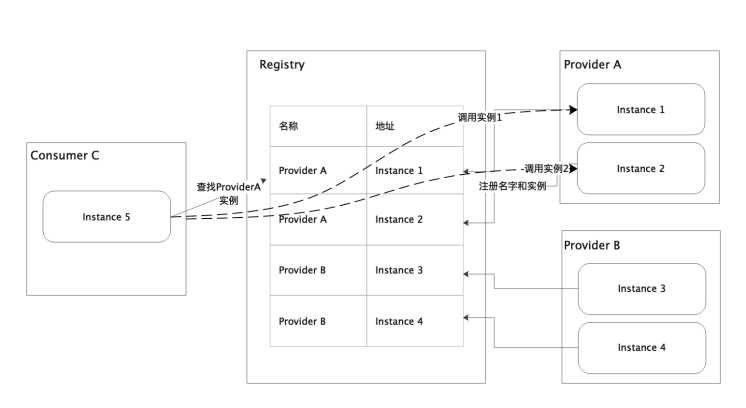
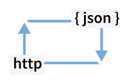
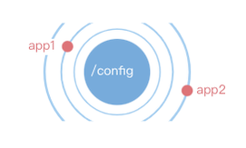

# 5 注册中心
## 5.1 什么是注册中心
注册中心可以说是微服务架构中的“通讯录“，它记录了服务名称和服务地址的映射关系。Consumer能够根据注册中心里的Provider的名称找到Provider的地址，因此Consumer能够与Provider地址建立连接，进行通信。（图要换）

注册中心是服务注册的重要环节，这一节我们主要了解下市面上有哪些注册中心

|  | Etcd | Consul | Nacos | Eureka | Zookeeper |
| --- | --- | --- | --- | --- | --- |
| 语言 | Go | Go | Java | Java | Java |
| 协议 | Raft | Raft+Gossip | Raft | Renew | Zab |
| cap | cp | cp/ap | cp/ap | ap | cp |

## 5.2 注册中心介绍
目前Go使用的注册中心主要是ETCD和Consul。ETCD相当于是java中的zookeeper，Consul相当于是java中的eureka。ETCD是轻量级的注册中心，简单易用。Consul可以支持agent部署，并且能实现跨机房注册中心。以下主要介绍ETCD。

### 5.2.1 什么是ETCD
ETCD是一个强一致性、分布式的键值存储系统。它提供了一种可靠的方法来存储需要由分布式系统或计算机集群访问的数据。它能够优雅地处理网络分区期间的领导人选举，并且能够容忍机器故障。
任何复杂的应用程序，例如从简单的web应用还是到复杂的Kubernetes，都能够从ETCD里进行读写操作。

应用可以从ETCD进行读写操作。最简单的用法是应用使用ETCD存储连接中的信息，当这些信息被改变后，应用通过监听这些改变事件，做一些自身调整。更高级的用法是我们可以使用ETCD的强一致性原理，实现多个任务的分布式锁。

### 5.2.2 ETCD特点
- 简单的接口类型：能够通过http+json操作ETCD
- KV存储结构：能够将数据存储在分层的数据结构中
- 监听数据变化：应用能够监听特定键或者目录，作出相应的变化

  
### 5.2.3 目前使用ETCD的项目
- kubernetes
- rook
- coredns
- m3
- openstack
- patroni
- trillian

## 5.3 注册中心的数据
- 注册服务调用ip port
- 注册服务调用的元数据
    - 编译时间
    - 分组信息
    - region
    - zone
    - env
- 注册服务监控ip port

## 5.4 注册中心CAP理论
