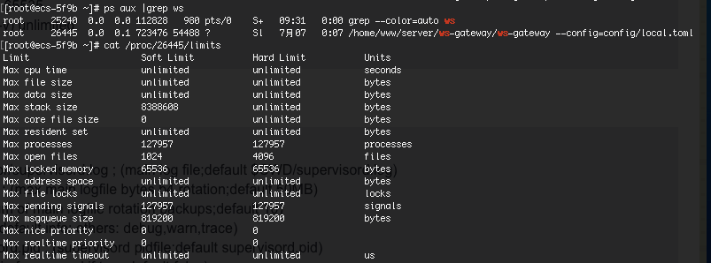

## 内核参数
### 1 
```bash
sysctl -a # 查看所有内核参数
vim /etc/sysctl.conf
sysctl -p # 立刻生效
```

### 2 net.core.somaxconn
对于一个TCP链接，Server与Client需要通过三次握手来建立网络链接，当三次握手成功之后，我们就可以看到端口状态由LISTEN转为ESTABLISHED，接着这条链路上就可以开始传送数据了

net.core.somaxconn是Linux中的一个内核(kernel)参数，表示socket监听(listen)的backlog上限。
什么是backlog？backlog就是socket的监听队列，当一个请求(request)尚未被处理或者建立时，它就会进入backlog。
而socket server可以一次性处理backlog中的所有请求，处理后的请求不再位于监听队列中。
当Server处理请求较慢时，导致监听队列被填满后，新来的请求就会被拒绝。

ulimit -n



### 3 FD问题
#### 3.1 系统配置
* /etc/security/limits.conf 
* ulimit -n

#### 3.2 systemd配置
* vim /lib/systemd/system/supervisord.service

[service]
LimitNOFILE=1000000

systemctl daemon-reload

#### 3.3 supervisor配置
修改supervisor minfds

[supervisord]
logfile=/var/log/supervisor/supervisord.log ; (main log file;default $CWD/supervisord.log)
logfile_maxbytes=50MB ; (max main logfile bytes b4 rotation;default 50MB)
logfile_backups=10 ; (num of main logfile rotation backups;default 10)
loglevel=info ; (log level;default info; others: debug,warn,trace)
pidfile=/var/run/supervisord.pid ; (supervisord pidfile;default supervisord.pid)
nodaemon=false ; (start in foreground if true;default false)
minfds=1024 ; (min. avail startup file descriptors;default 1024)
minprocs=200 ; (min. avail process descriptors;default 200)
