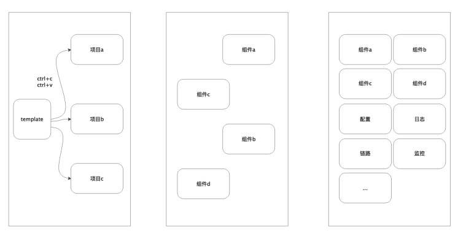
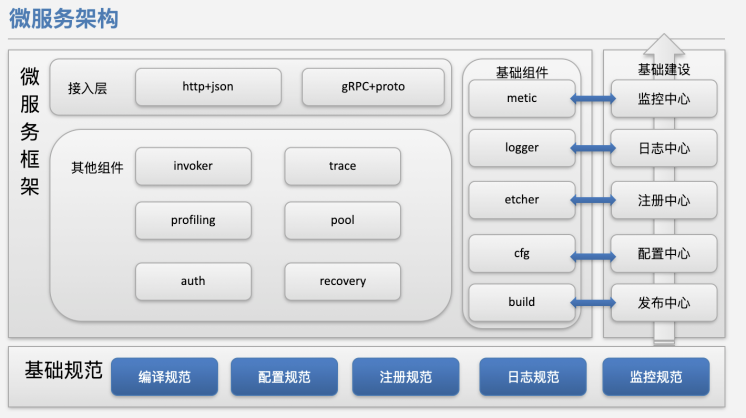
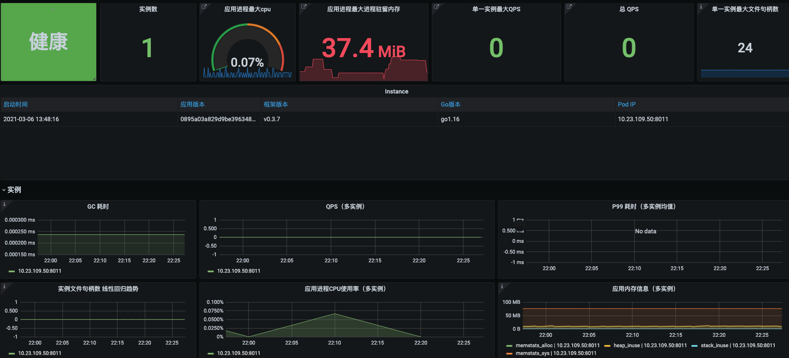
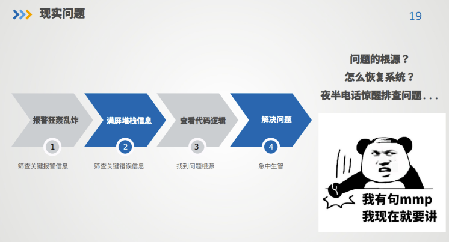
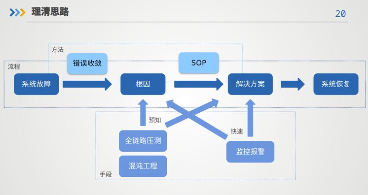
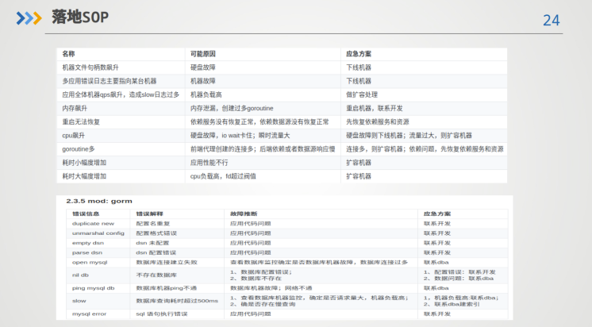

# 1 微服务介绍
## 1.1 微服务框架
由单一应用发展到微服务，第一阶段重复代码主要是复制粘贴，第二阶段重复代码做到复用，将一些功能抽为组件，最后一个阶段是将各个组件进行配置、日志、链路、监控等治理，完成统一框架，如下所示。

业界针对框架和组件设计有两种看法。一种是轻量级的框架例如gin、echo，只提供基本http服务能力，其他配置、日志、监控等组件都需要工程师自行拼凑；另一种则是重量级的框架例如beego、kratos、jupiter、go-zero，具有all in one能力，无需在像搭乐高一样，去拼凑组件，工程师直接使用该框架进行开发业务。

个人认认为重量级框架对于公司层面是有一定好处的，其优势主要在于以下几点：

- 能够有统一完整的标准
    - 每个人写的代码都基本一致，谁都可以维护
    - 线上出了问题，不用问repo在哪，配置在哪、日志在哪
    - 框架中的基础组件可以更好的适应基础建设，省去无谓的适配
- 能够有公司所需要的所有组件
    - 无需让业务方搭乐高
    - 配置驱动组件，所有组件用法保持一致，降低心智负担
    - 编写文档更加方便
    - 方便对组件的统一治理
- 统一mono repo
    - 对业务方屏蔽具体底层实现，业务方只需要对框架升级版本即可
    - 节约人力成本、方便ci


理解了框架的优点后，我们再来看下公司级别框架的示意图。

公司级别的框架一般都是建立在公司的基础规范之上，与基础建设进行紧密结合，从而降低公司的运维成本、提升研发效率、提升服务线上运行的稳定性。

接下来我们就来讲下微服务相关的一些概念，来提升我们的微服务能力

## 1.2 微服务标准
如果微服务没有标准和规范，一旦达到上百个微服务，每个微服务都进行编写编译脚本、配置路径、监控模版，这是对运维人力的一个极大浪费。因此微服务最为核心的就是标准。
### 1.2.1 编译规范
我们会使用系统将编译文件makefile、dockerfile存储在远端。如果本地没有编译文件，则默认选择远端编译规范。如果本地有编译文件，那么则选用本地编译文件。
我们会将许多元数据编译到二进制包里，作为应用的元数据。

- 应用名称
- 编译时间
- 编译机器
- 框架版本
- 应用版本

编译好的二进制包，我们可以通过./main --version，排查该二进制的编译情况


### 1.2 配置规范
我们会将所有的开源组件做一次wrapper，这样的好处有几方面

- 统一所有组件的配置方式、调用方式
- 兜底默认配置
- interface设计，切换组件
- 统一配置形式
#### 1.2.1 统一组件配置方式
我们通过配置去驱动组件，业务方无需关注组件的初始化，就能够直接使用组件。同时统一调用组件的API方式，能够降低业务方的心智负担。例如调用一个redis和mysql的配置和API如下所示。
```toml
[redis]
addr = "127.0.0.1:6379"
[mysql]
addr = "root:root@tcp(127.0.0.1:3306)/ego?charset=utf8mb4&parseTime=True&loc=Local&readTimeout=1s&timeout=1s&writeTimeout=3s"
```
```go
redisClient := eredis.Load("redis").Build()
redisClient.Set(context.Background(),"hello", "ego", 0)

str, err := redisClient.Get(context.Background(), "hello")
fmt.Println("get hello", str, err)

mysqlClient := egorm.Load("mysql").Build()
mysqlClient.Where("id = 1").Find(&user)
```
可以看到调用方式都是Load一个配置key，在通过Build方法，创建一个组件。所有组件都可以这样，依葫芦画瓢的使用。
#### 1.2.2 兜底默认配置
对于业务方而言，很少会去查看开源组件的源码，有时候很多有必要的参数都是缺省的，这就导致有可能调用是没问题，但是在细节上处理的不够到位。这个时候我们就需要组件的兜底默认配置。他的处理方式如下所示：
```go
type config struct {
    Addrs                      []string      // Addrs 实例配置地址
    Addr                       string        // Addr stubConfig 实例配置地址
    Mode                       string        // Mode Redis模式 cluster|stub|sentinel
    MasterName                 string        // MasterName 哨兵主节点名称，sentinel模式下需要配置此项
    Password                   string        // Password 密码
    DB                         int           // DB，默认为0, 一般应用不推荐使用DB分片
    PoolSize                   int           // PoolSize 集群内每个节点的最大连接池限制 默认每个CPU10个连接
    MaxRetries                 int           // MaxRetries 网络相关的错误最大重试次数 默认8次
    MinIdleConns               int           // MinIdleConns 最小空闲连接数
    DialTimeout                time.Duration // DialTimeout 拨超时时间
    ReadTimeout                time.Duration // ReadTimeout 读超时 默认3s
    WriteTimeout               time.Duration // WriteTimeout 读超时 默认3s
    IdleTimeout                time.Duration // IdleTimeout 连接最大空闲时间，默认60s, 超过该时间，连接会被主动关闭
    Debug                      bool          // Debug开关， 是否开启调试，默认不开启，开启后并加上export EGO_DEBUG=true，可以看到每次请求，配置名、地址、耗时、请求数据、响应数据
    ReadOnly                   bool          // ReadOnly 集群模式 在从属节点上启用读模式
    SlowLogThreshold           time.Duration // 慢日志门限值，超过该门限值的请求，将被记录到慢日志中
    OnFail                     string        // OnFail panic|error
    EnableMetricInterceptor    bool          // 是否开启监控，默认开启
    EnableTraceInterceptor     bool          // 是否开启链路，默认开启
    EnableAccessInterceptor    bool          // 是否开启，记录请求数据
    EnableAccessInterceptorReq bool          // 是否开启记录请求参数
    EnableAccessInterceptorRes bool          // 是否开启记录响应参数
}

// DefaultConfig default config ...
func DefaultConfig() *config {
    return &config{
        Mode:                    StubMode,
        DB:                      0,
        PoolSize:                10,
        MaxRetries:              3,
        MinIdleConns:            100,
        DialTimeout:             xtime.Duration("1s"),
        ReadTimeout:             xtime.Duration("1s"),
        WriteTimeout:            xtime.Duration("1s"),
        IdleTimeout:             xtime.Duration("60s"),
        ReadOnly:                false,
        Debug:                   false,
        EnableMetricInterceptor: true,
        EnableTraceInterceptor:  true,
        SlowLogThreshold:        xtime.Duration("250ms"),
        OnFail:                  "panic",
    }
}
```
会先使用一个default config，作为兜底参数，然后在根据用户配置项进行解析，如果用户配置了，那么就是使用用户配置。如果用户没有配置，就使用框架默认配置。例如以上redis组件，用户直接使用该组件，可能会漏配dial、read、write参数，在一些情况下可能触发问题。

#### 1.2.3 统一配置形式
- 每个组件的配置名称统一，例如都叫password，不会存在有的是pwd，有的是password
- 调试配置
- 日志配置
- 链路配置
- 监控配置
- 降级配置


### 1.3 注册规范
注册需要约定好，注册的方式，例如有三种：

- 自行注册
- k8s的dns注册
- k8s的api注册

以上内容后面可以单独来讲，这一块的注册主要是服务调用的注册。我们这边还要讨论另外的注册信息。一个是元数据、一个是监控注册、一个是双向注册。
#### 1.3.1 元数据
这个分为两个

- key为/prefix/poviders/appname

这个key是provider启动的时候，将编译元数据，还有运行时获取的region、zone、env、启动时间等数据写入value

- key为/prefix/configurators/appname

这个key是后台将流控、sentinel等治理信息写入value
#### 1.3.2 监控注册

- 一种是自行注册，然后通过agent，写入prometheus的conf文件，做到监控的服务发现
- 一种是通过打标签，通过prometheus的operator做服务发现
#### 1.3.3 双向注册
通常我们只有服务注册，而忽略了客户端注册。客户端注册的有dubbo，好处可以做分组、权限控制、治理。

### 1.4 日志规范
日志我们要区分为四类
- 系统日志systemd
- K8S日志
- 框架日志
- 业务日志


系统日志、k8s日志、框架日志都是可以是结构化日志，确定索引类型，统一采集，关闭全文索引。
#### 1.4.1 日志性能
日志一般是最影响性能的，通常占到框架10～20%，所以会合并buffer，异步写。

#### 1.4.2 日志查bug
结合配置中心，zap的动态日志能力，可以让研发养成好习惯多打debug日志，线上关闭，出现问题动态开启。

### 1.5 服务监控
#### 1.5.1 监控维度

- 黄金指标
    - 流量
    - 延迟
    - 错误
    - 饱和度
- 维度
    - 系统分层
        - 应用维度
        - 机器维度
        - 资源维度
    - 应用维度
        - 应用实例
        - 单个应用大盘
        - 多个应用大盘
        - top榜

#### 1.5.2 框架监控五个维度

- 应用基本信息
- 服务端监控：http、grpc
- 客户端监控：http、grpc、mysql、redis、mongo、kafka
- 缓存监控：命中率
- 任务监控：执行次数，状态码


#### 1.5.3 统一字段用法
如果对prometheus不做规范，业务方自行使用，可能会造成prometheus的性能急剧下降。举个例子，当a业务方使用http的路径叫url，b业务方使用http的路径叫method，那么同一种类型的业务，两个字段产生的数据就会成为笛卡积，影响性能。

为了进一步优化日志和监控字段，我们这里是有一个实现细节，例如之前我们把redis 的命令叫 command，mysql 语句叫 sql，http 请求叫 url，这样就导致我们排查以上问题的时候，写的查询语句特别复杂，很难收敛做分析和发现问题，所以我们后来将一些共性的指标统一成一个名字，将刚才所说的一些问题在日志和监控分成不同的模块，但取名都叫 method，将查询正交化，方便我们用一条语句就可以把所有错误都找出来。

收敛后的日志可以做大盘


监控可以根据应用进行筛选



#### 1.5.4 统一错误码
业务方错误码根据aid*10000
框架错误码10000以下

### 1.6 Governor
后面在聊

## 1.7 排查故障
现实排查故障如下所示

以上问题，研发和运维不想疲于应付问题，那么就需要从底层自上而下设计，通过框架的错误收敛找到根因、结合监控、报警、混沌工程、全链路压测手段形成sop手册，作为解决方案。如下所示。



最终落地为sop手册，如下所示

图中错误信息，是框架的唯一错误码，能够通过这个统一监控和报警，立刻知道需要做什么事。
