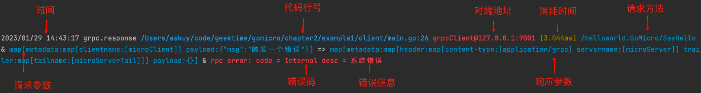
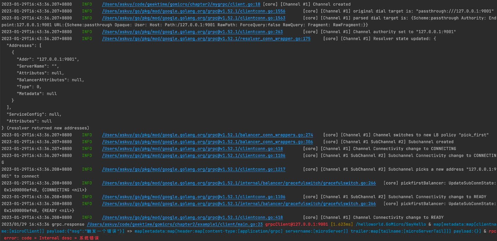
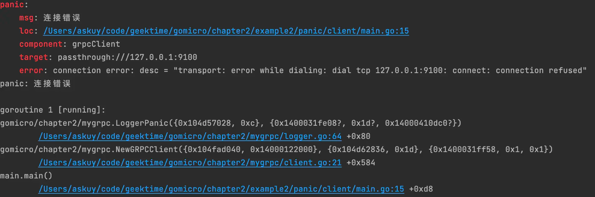
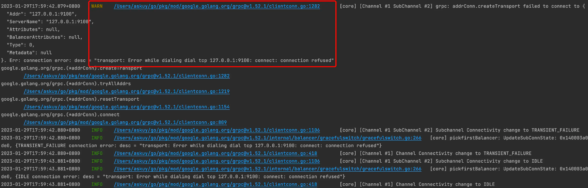

# 学会快速调试和定位错误，开发效率飞跃提升

理想的情况下，我们都希望微服务之间的调用，能够得到正确的响应，这样我们就可以赶紧开发完代码，联通OK，早点下班。

但实际业务开发时就没有这么顺利了，我们在和对方联调过程中，对方的服务端不一定是正确的响应，可能他的服务响应的数据有问题、状态码有问题，更或者服务直接挂掉。在联调阶段，客户端发送错误的数据或者服务端不正确的响应，会导致我们花大量时间排查这类问题。

但是这类问题的排查并不容易，我举几个常见情况，不知道你有没有经历过：

* 日志或监控对一些错误信息记录不全，没有足够的日志信息来定位问题。
* 业务报错了，但不知道在微服务流程中哪一步出现的问题。
* 已经报错了，但程序仍然在执行，丢失了错误信息。
  遇到这种情况，我们要想定位问题，快速调试微服务系统，需要有好的工具和方式。今天我们就在上一讲的基础上继续开发，看看如何解决这3类问题。


## 快速调试

排查问题，我们的第一想法就是调试。调试有很多种方法，可以用断点调试，也可以使用测试用例。不过断点调试，需要一步步断点，分析的时间会很长，比较麻烦；测试用例调试，适用于业务功能稳定的场景。最方便的还是通过日志来调试。

日志调试可以适用任何场景，使用起来简单，我们可以利用日志中关键信息高亮，快速定位到该信息，还可以根据在日志中写入的一些特定的信息，在日志中检索，快速知道业务执行到哪一步。

那日志调试代码怎么写呢？

你可能觉得非常简单，不就是简单记录下日志吗？但实际情况是我们经常因为缺乏经验，记录的日志信息不全，导致后期反复追加这些日志信息，影响开发速度。**比如开发一个功能，我们需要使用微服务调用一个接口，这个时候服务端报错了或者数据结构响应不正确，如果没有对应调试信息，我们可能开发了很久的业务功能后，才发现报错是调用接口导致的问题。

所以要想快速调试，我们需要有充足的调试信息，这样才能更快地知道对端的一些情况，去判断是我们的代码问题还是对端问题。

### 充足的调试信息

根据我的工程经验，总结至少需要7种基本调试信息。

* 对端：能够确定对端的唯一来源我们称为对端，例如对端的应用名称、对端的配置、对端的IP。
* 请求方法：对端请求的方法。
* 请求参数：请求的参数信息，包括 `header` 里的 `metadata` 。
* 响应数据：响应的数据，包括 `header` 里的 `metadata` 。
* 状态信息：错误码和错误信息。
* 耗时时间：请求到响应的耗时时间。
* 执行行号：调用处执行的行号。
  明白了该写哪些，接下来我们就实现一个`gRPC`的日志拦截器加入这些信息。

首先在上一讲的`NewGRPCClient`的函数中，我们加入`debug`拦截器函数。

```go
func NewGRPCClient(ctx context.Context, target string, opts ...grpc.DialOption) (conn *grpc.ClientConn, err error) {
   // debug的客户端拦截器
   opts = append(opts, grpc.WithChainUnaryInterceptor(debugUnaryClientInterceptor()))
   return grpc.DialContext(context.Background(), target, opts...)
}
```
代码中`grpc.WithChainUnaryInterceptor`函数是`gRPC`包中提供的，在`unary`调用的时候能把我们写的`debugUnaryClientInterceptor`拦截器注入到`gRPC` 调用中，这样在发送请求的时候，就会把逻辑执行到`debugUnaryClientInterceptor`拦截器里。
然后在`debugUnaryClientInterceptor`拦截器中，加入调试信息。

```go
func debugUnaryClientInterceptor() grpc.UnaryClientInterceptor {
   componentName := "grpcClient"
   return func(ctx context.Context, method string, req, reply any, cc *grpc.ClientConn, invoker grpc.UnaryInvoker, opts ...grpc.CallOption) error {
      beg := time.Now()
      // 获取对端信息
      var p peer.Peer
      // 响应的头信息
      var resHeader metadata.MD
      // 响应的尾信息
      var resTrailer metadata.MD
      // 请求的头信息
      reqHeader, _ := metadata.FromOutgoingContext(ctx)
      opts = append(opts, grpc.Header(&resHeader))
      opts = append(opts, grpc.Trailer(&resTrailer))
      opts = append(opts, grpc.Peer(&p))
      err := invoker(ctx, method, req, reply, cc, opts...)
      // 将err信息转换为grpc的status信息
      statusInfo, _ := status.FromError(err)
      // 请求
      var reqMap = map[string]any{
         "payload":  xstring.JSON(req),
         "metadata": reqHeader,
      }
      var resMap = map[string]any{
         "payload": xstring.JSON(reply),
         "metadata": map[string]any{
            "header":  resHeader,
            "trailer": resTrailer,
         },
      }
      // 记录此次调用grpc的耗时
      cost := time.Since(beg)
      if err != nil {
         log.Println("grpc.response", MakeReqAndResError(fileWithLineNum(), componentName, p.Addr.String(), cost, method, fmt.Sprintf("%v", reqMap), statusInfo.String(), ""))
      } else {
         log.Println("grpc.response", MakeReqAndResInfo(fileWithLineNum(), componentName, p.Addr.String(), cost, method, fmt.Sprintf("%v", reqMap), resMap, statusInfo.String()))
      }
      return err
   }
}
```
这里的代码实现和前面讲到的7种基本调试信息一一对应。
* 对端：使用`grpc.Peer`函数，加入到调用服务的`grpc.CallOption`可选项中，我们可以获取到服务端的`addr`信息。
* 请求方法：使用`grpc.UnaryClientInterceptor`中第二个参数`method`，可以得到请求方法。
* 请求参数：使用`metadata.FromOutgoingContext`从`ctx` 中获取请求时候的`header` 信息，然后从`grpc.UnaryClientInterceptor`中第三个参数`req`合并组成一个`reqMap`，得到我们的请求参数。
* 响应数据：使用`grpc.Header`和`grpc.Trailer`，加入到调用服务的`grpc.CallOption`可选项中，我们可以获取到服务端的响应头信息和尾信息，然后从`grpc.UnaryClientInterceptor`中第四个参数`res`合并组成一个`resMap`，得到我们的响应参数。
* 状态信息：使用`status.FromError(err)`函数，将`err`信息转化为gRPC的status信息，得到我们的状态信息
* 耗时时间：在`invoker`函数之前记录一个`beginTime`时间，然后在`invoker`函数之后根据`time.Since(beginTime)`算出这次调用消耗时间`cost`。
* 执行行号：使用`runtime.Caller`函数，通过过滤一些包的路径，找到真正执行的代码行号，这里需要打印全路径，这样例如在`Goland IDE`里就可以直接点击这个代码行号，进入到出错的代码里。
  完成拦截器代码后，我们测试一下。

在服务端代码中，我们根据客户端的一个特定Msg信息，抛出一个错误，来模拟服务端的错误返回。

```go
func (GoMicro) SayHello(ctx context.Context, request *helloworld.HelloReq) (*helloworld.HelloRes, error) {
   log.Println("服务端收到信息：" + request.GetMsg())
   if request.Msg == "触发一个错误" {
      return nil, status.New(codes.Internal, "系统错误").Err()
   }
   return &helloworld.HelloRes{
      Msg: "我来自服务端",
   }, nil
}
```

直接运行客户端代码。

```go
resp, err := client.SayHello(ctx, &helloworld.HelloReq{
   Msg: "触发一个错误",
})
```

可以通过下图看到调试信息。相比我们上一讲的`hello world`响应，这里展示各种报错信息。



红色的高亮报错非常直观，我们可以看到RPC报了系统错误，并返回了Internal错误码，而且因为调试信息中有代码的全路径，我们可以在`Goland IDE`里直接点击这个代码行号，进入到出错的代码中，直接去解决问题，节约大量修复问题的时间。

### 调试的流程信息

微服务一次调用请求的响应信息，我们可以直观看到了，但是实际上，一次请求调用，在客户端内部还是会有一系列的流程操作，如果我们想知道是名字服务问题、负载均衡问题，通过上面的日志也无法排查。

这个时候，我们就需要**打开这些流程的调试信息**，更加深入地了解微服务调用的内部运行机制。

在`gRPC`包中，官方已经将微服务的调用流程记录了日志，所以我们在`NewGRPCClient`函数中，将业内常用的`zap`日志库，注入到官方提供的`grpclog.SetLoggerV2`函数，就可以看到整个`gRPC`调用的流程信息。

```go
func NewGRPCClient(ctx context.Context, target string, opts ...grpc.DialOption) (conn *grpc.ClientConn, err error) {
   grpclog.SetLoggerV2(zapgrpc.NewLogger(grpcLogger))
   return grpc.DialContext(ctx, target, opts...)
}
```

上面代码中注入`zap`的`grpcLogger`对象时，如果使用`zap` 默认的配置，日志无法高亮，日志具体执行的行号不正确，也无法通过IDE点击到执行代码逻辑地方。所以我们还需要改造一下，方便查看流程信息。

```go
var (
   grpcLogger, _    = NewDebugLogger().Build(zap.AddCallerSkip(5))
)
func NewDebugLogger() zap.Config {
   return zap.Config{
      Level:            zap.NewAtomicLevelAt(zap.DebugLevel),
      Development:      true,
      Encoding:         "console",
      EncoderConfig:    defaultDebugConfig(),
      OutputPaths:      []string{"stderr"},
      ErrorOutputPaths: []string{"stderr"},
   }
}
func defaultDebugConfig() zapcore.EncoderConfig {
   return zapcore.EncoderConfig{
      TimeKey:        "ts",
      LevelKey:       "lv",
      NameKey:        "logger",
      CallerKey:      "caller",
      MessageKey:     "msg",
      StacktraceKey:  "stack",
      LineEnding:     zapcore.DefaultLineEnding,
      EncodeLevel:    debugEncodeLevel,
      EncodeTime:     zapcore.ISO8601TimeEncoder,
      EncodeDuration: zapcore.SecondsDurationEncoder,
      EncodeCaller:   zapcore.FullCallerEncoder,
   }
}
func debugEncodeLevel(lv zapcore.Level, enc zapcore.PrimitiveArrayEncoder) {
   var colorize = xcolor.Red
   switch lv {
   case zapcore.DebugLevel:
      colorize = xcolor.Blue
   case zapcore.InfoLevel:
      colorize = xcolor.Green
   case zapcore.WarnLevel:
      colorize = xcolor.Yellow
   case zapcore.ErrorLevel, zap.PanicLevel, zap.DPanicLevel, zap.FatalLevel:
      colorize = xcolor.Red
   default:
   }
   enc.AppendString(colorize(lv.CapitalString()))
}
```
因为是调试信息，我们使用`OutputPaths:[]string{"stderr"}` 让日志在终端显示。
关于日志的级别，设置为`debug`级别及以上都显示，并使用`debugEncodeLevel`函数用不同颜色显示不同日志级别，例如`info`级别使用绿色，`error`、`panic`、`fatal`级别使用红色。

代码行号使用全路径的`zapcore.FullCallerEncoder`，这样编辑器可以直接点击到对应代码执行位置。由于`grpc`包中调用链套了5层，我们需要设置`NewDebugLogger().Build(zap.AddCallerSkip(5))`，这样可以正确找到`gRPC`包中执行的地方。

最后我们再执行客户端的调用，可以看到这样的调用流程信息。


在图中，可以看到了整个`gRPC`的调用情况，如果出现名字服务问题或者负载均衡问题，我们就可以通过这些日志排查出问题。

## 快速定位问题

现在，我们实现了调试，可以定位问题了。但在微服务体系中，每个应用会使用多种组件和调用多个业务`API`，调用链路变成网状拓扑，导致微服务整体架构的复杂度变高。

如果某个服务出现问题，我们可以用刚才的方法检索日志查到这个错误信息，但这可能不是真正的根因错误，可能是因为其他应用的问题导致**，如果调用链路很长，排查会非常麻烦，定位根因问题会变得非常慢。我们需要快速定位问题的能力。

为了帮你更好理解在微服务的调用链路中排查错误问题，我们来看个具体例子。

有一个流程，a服务调用b服务，b服务在调用c服务。假设b服务在发布的时候，配置错了c的地址，无法连接c服务，怎么办呢？我们有两种方式处理这种问题。

* b服务记录了错误日志，但仍然启动b服务，a服务用了新版本的b服务。
* b服务，停止启动并记录错误日志，a服务用了老版本的b服务。
  
这两种处理错误方式，你觉得哪种是对的呢？带着你的思考，我们仔细分析一下这两种方式带来的影响。

方式一，仍然启动b服务，b记录的这种核心错误信息会藏在了某些日志中，因为a用了新版本的b，当有请求调用的时候，a服务中某个接口报错，但这个接口报错并不是根因，实际的根因是b服务配错了c服务的配置，但是这种错误被隐藏，我们排查的时候需要很久。

方式二，b服务在初始化的时候，发现了b服务连接不上c服务，停止启动，在最后一行可以看到报错信息，业务方可以立刻查看到核心错误。而且因为没有启动成功，不会更新b服务版本，因此a服务不会受影响，线上功能都是正常的。

所以很明显第二种处理方式是对的。这种方式可以不让报错传递到别的服务，还能让我们在发现应用出现问题后，直接看最后一行日志就知道报错信息了，而不是像第一种处理方式，报错信息被隐藏在海量的日志中。

第二种方式，也就是我们常说的`Fail Fast`理念 。

`Fail Fast`理念在微服务中就是一个应用启动如果出现故障，会立刻停止启动，我们不会让应用在有缺陷的情况下仍然运行；同时在应用的每个核心组件里，我们会设置多个检查，检查组件是否正常运行，这样可以尽早发现问题，避免系统运行后导致更严重的问题。

所以，想要快速定位问题，我们需要在调试阶段发现核心错误后，应该让系统直接`Panic`，并将`Panic`的错误信息，组件、配置名、代码行号、错误信息高亮显示出来。总结出来是三点。

* 必要的错误信息，让我们知道是在哪个地方报错，哪个微服务有问题。
* 错误信息高亮，显示红色让错误更加明显。
* 核心错误中断系统启动，让错误显示在最后一行。
### Fail Fast 代码实现

现在根据`Fail Fast`理念，我们看看发现核心错误后，应该如何实现代码。

首先在`NewGRPCClient`函数中需要加入`ctx, _ = context.WithTimeout(ctx, time.Second)`，使得`gRPC`创建连接的时候有`1s`的超时时间，同时创建连接使用`grpc.WithBlock`的阻塞模式，并使用`grpc.FailOnNonTempDialError(true)`显示连接的真正报错。

```go
func NewGRPCClient(ctx context.Context, target string, opts ...grpc.DialOption) (conn *grpc.ClientConn, err error) {
   ...
   ctx, _ = context.WithTimeout(ctx, time.Second)
   opts = append(opts, grpc.WithBlock())
   opts = append(opts, grpc.FailOnNonTempDialError(true))
   conn, err = grpc.DialContext(ctx, target, opts...)
    ...
   return
}
```

然后在连接 `gRPC` 地方，记录错误。我们认为连接 `grpc` 是核心功能，所以这里出现报错，我们需要中断启动，并且调用`LoggerPanic`方法，记录核心错误的3个必要信息：组件名、对端连接信息、错误信息。

```go
func NewGRPCClient(ctx context.Context, target string, opts ...grpc.DialOption) (conn *grpc.ClientConn, err error) {
   ...
   conn, err = grpc.DialContext(ctx, target, opts...)
   if err != nil {
      LoggerPanic("连接错误", zap.String("component", "grpcClient"), zap.String("target", target), zap.Error(err))
   }
   return
}
```

接下来是`LoggerPanic`的代码实现。

```go
func LoggerPanic(msg string, fields ...zap.Field) {
   enc := zapcore.NewMapObjectEncoder()
   for _, field := range fields {
      field.AddTo(enc)
   }
   fmt.Printf("%s: \n    %s: %s\n", xcolor.Red("panic"), xcolor.Red("msg"), msg)
   if _, file, line, ok := runtime.Caller(3); ok {
      fmt.Printf("    %s: %s:%d\n", xcolor.Red("loc"), file, line)
   }
   for key, val := range enc.Fields {
      fmt.Printf("    %s: %s\n", xcolor.Red(key), fmt.Sprintf("%+v", val))
   }
   msg = fmt.Sprintf("%-32s", msg)
   panic(msg)
}
```
把对应的核心错误的必要信息高亮，通过panic终止程序，在最后一行显示错误。
完成了我们验证一下。假设在客户端配置一个不存在的`grpc`服务端地址`127.0.0.1:9100`，可以看到启动客户端会报详细的错误和堆栈信息。



作为对比，我们使用`notpanic example`代码，同样设置一个不存在的`gRPC`地址，可以发现在日志中虽然有记录错误，但它在其他日志上面，如果业务复杂，日志非常多，刷屏后，很难发现这种核心报错信息。



## 总结

在开发过程中，我们经常遇到日志不全，难以排查的问题，要想快速定位，我们需要有充足的调试信息、调试的流程信息、调试的链路信息。

在微服务系统中，只有日志是远远不够的，由于微服务复杂的拓扑关系，例如a服务调用b服务，b服务调用c服务，c服务出现问题会间接影响到a服务。这种服务之间传递错误信息的问题，导致我们在a服务中日志虽然能看到报错，但并不是根因。

我们需要运用`Fail Fast`理念，让启动出现故障的应用，立刻停止启动并报错，避免该应用的错误传递到上层服务，让核心错误只存在有问题的应用中，并让错误展示在最后一行，避免错误隐藏在大量日志中，会让排查问题更简单，更快速。

掌握了今天的方法，我们再来看开头的常见问题如何解决。

* 日志或监控对一些错误信息记录不全，没有足够的日志信息来定位问题。补齐日志信息可以解决。
* 业务报错了，但不知道在微服务流程中哪一步出现的问题。`gRPC`的流程日志开启可以解决。
* 已经报错了，但程序仍然在执行，丢失了错误信息。`Fail Fast`可以解决。

以上理念都在[EGO](https://github.com/gotomicro/ego/tree/master/client/egrpc)的`gRPC Client`设计理念中实现，可以阅读该源码.
 

## 思考题
代码调试、排查问题有很多种方法，我们今天介绍的是日志的调试方法。你还有哪些排查问题的好方法和手段？
欢迎留言交流。如果觉得今天的内容对你有帮助，也欢迎分享给你身边的朋友一起学习。


## 相关链接
* [EGO](https://github.com/gotomicro/ego)
* [gRPC metadata](https://github.com/grpc/grpc-go/blob/master/Documentation/grpc-metadata.md#unary-call)
* [fail-fast 维基百科解释](https://en.wikipedia.org/wiki/Fail-fast)


