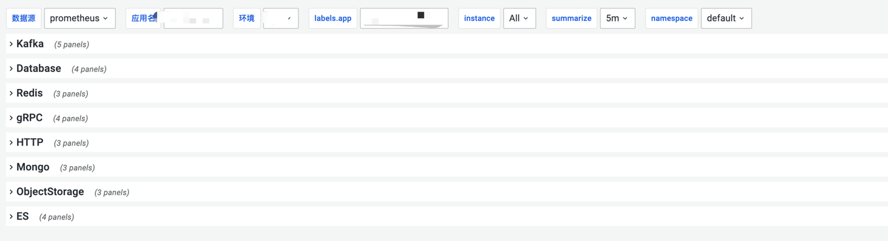

## 监控图配置方式
使用以下配置，就可以看到对应监控。
`ego1.2.0`版本以上，在`governor`配置里打开`EnableConnTcpMetric`，就可以看到常用MySQL, Redis等端口的`time wait`对于我们调整连接池，优化性能有帮助。
[dashborad_overview.json](https://github.com/gotomicro/ego-doc/blob/main/docs/practice/sla/dashboard_overview.json)

[client_overview.json](https://github.com/gotomicro/ego-doc/blob/main/docs/practice/sla/client_overview.json)
在这里，你可以点开mysql，redis，监控图，可以看到对应的mysql,redis是否存在连接池阻塞。
如果出现，请及时调整连接池大小
