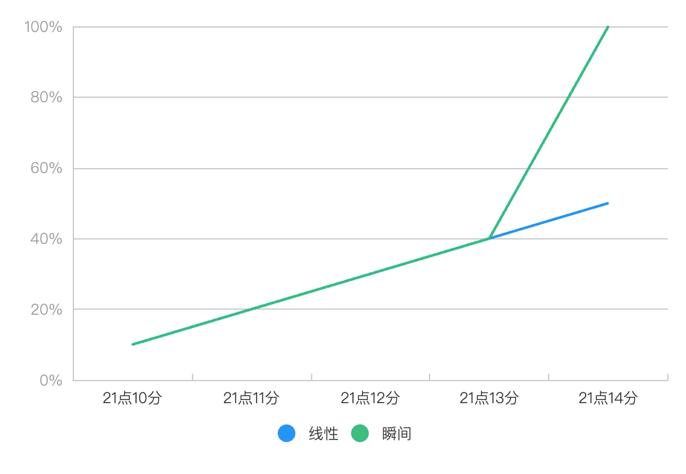
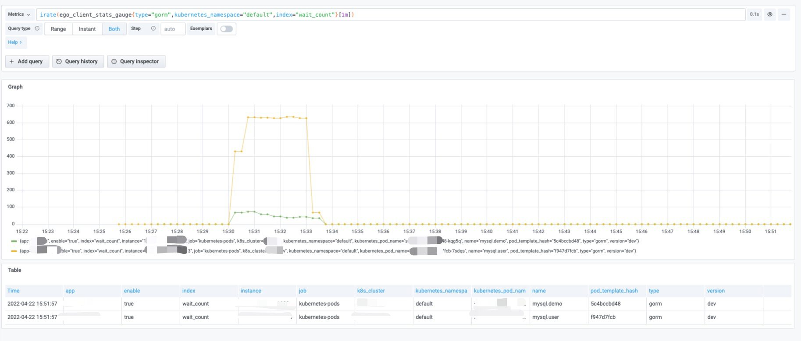

## 稳定性-运行观测

服务运行还好好的，为什么突然出问题了？这种服务突然崩掉，大家都会比较懵逼，因为会发现系统到处都是问题，很难找到根因。

我们要了解这种情况，首先得知道系统是如何崩溃的。

我们通常认为系统崩溃是线性崩溃，如下图蓝色曲线。而实际上系统崩溃在某些情况是线性增加压力，在某个临界值会瞬间崩溃，如下图绿色曲线。

这种瞬间崩溃，不稳定现象。通常有以下几种可能。

* 突发流量，核心服务扛不住
    * CPU打满
* Node服务，CPU共享问题
    * CPU打满
* 中间件出问题
    * CPU打满
    * 硬盘IO打满
      我们如何预防这些情况，避免服务的不稳定。

## 突发流量

突发流量在业务中非常常见。这种突发流量要如何预防，首先要了解业务场景，来合理规划资源。例如像 ToC 这种有的时候可能存在10倍的流量，那么你的服务器的CPU需要有非常大的冗余，像 ToB 突发流量都不会太大，可能是2倍的流量，那么服务器的CPU，只需要留较小的冗余。

在这种突发流量中，我们有个非常关键的应对措施，就是合理设置连接池，可以参考我们写的[MySQL的MaxIdleConns不合理，会变成短连接](https://mp.weixin.qq.com/s/zxlgnFkcEwaSDx5uJZO8Ig)的原理。在Go的MySQL中会有四个参数。

* maxIdleCount 最大空闲连接数，默认不配置，是2个最大空闲连接
* maxOpen 最大连接数，默认不配置，是不限制最大连接数
* maxLifetime 连接最大存活时间
* maxIdleTime 空闲连接最大存活时间
  如果我们设置，例如全部用默认参数，那么将会有大量短连接。退化为短连接的业务通常是有长连接的业务性能的20～40%左右。因为服务和中间件CPU性能损耗最大的阶段时建立连接。

所以我们需要将maxIdleCount设置大点，但这个值设置到多大呢？很多同学都会感觉不知道如何配置，这个就要根据你的业务情况来定。在这里有两个方式来调整这个值。
（todo，ego框架准备加回time wait指标，但这个指标监控会有个问题，就是在net conns较多的情况下，因为/proc/进程id/netstat是个大文件，监控读取该文件会导致业务请求毛刺情况，要做好开关）
* 查看你的MySQL客户端的监控，看是否有wait_count，如果存在出现这个指标，说明MySQL客户端已经到达maxOpen最大值，那么你需要进一步调大你的maxIdleCount和maxOpen。

接下来我们再来看下如何设置maxLifetime和maxIdleTime。这些参数的设置是跟MySQL服务端的idle timeout有相关性。MySQL服务端设置了idle timeout，那么当MySQL客户端没有活跃，会将MySQL客户端给踢掉。所以我们需要将maxLifeTime，maxIdleTIme设置小于MySQL服务端的idle tiemout，可以避免因为客户端和服务端的时间差产生一些不必要的EOF、connection reset by peer操作。这里提一点，云厂商通常idle timeout为0是不会踢掉MySQL客户端，所以可以尽量设大点，避免idle conn被回收，来应对突发流量。

## Node服务，CPU共享问题
* k8s是cgroup share模式。那么CPU都是抢占式
* 假设CPU密集型运算和IO密集型核心业务在同一Node节点中，那么在NodeCpu资源充足情况下，是没有太大问题，但一旦有突发流量，导致Node Cpu上去，会因为抢占问题，导致核心业务可能抢不到CPU，影响响应速度，进一步恶化整个微服务系统，出现一些瞬间崩溃问题。
* 解决以上问题
* 需要将CPU密集型服务和IO密集型服务拆离
* 核心服务所在Node节点上不要存在超卖问题
* 核心服务Request Limit设置为1:1，避免被驱逐

## 中间件出问题 todo

* 观测 MySQL客户端Slow，Redis客户端Slow
* 服务端的一些排查方式
  // todo

* Prometheus监控图
* 日志如何分析

* [docker资源限制和lxcfs实现对容器资源视图隔离](https://cloud.tencent.com/developer/article/2368982?areaId=106001)
* [简单介绍cgroups以及在K8s中的应用 - CPU](https://cloud.tencent.com/developer/article/2314652)

